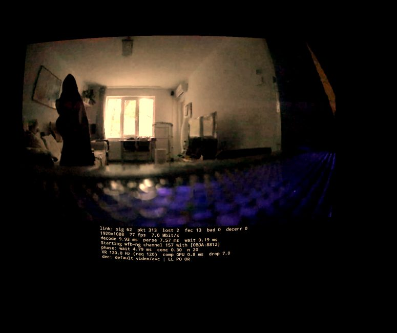
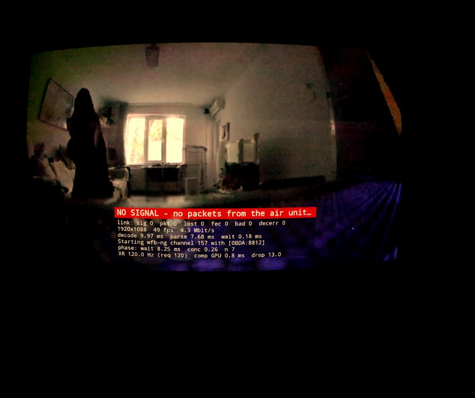
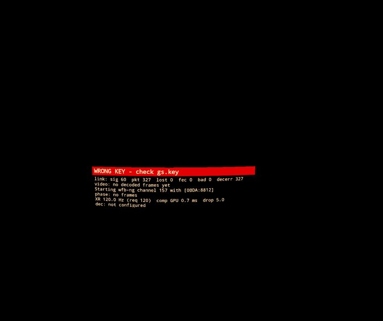
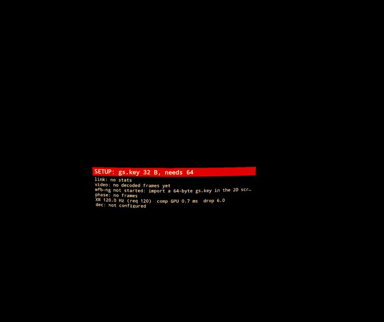

# Quest native XR mode (experimental)

A second activity, `XrVideoActivity`, shows the stream **inside an OpenXR session** instead of as a flat
2D panel. MediaCodec decodes straight into a compositor-owned Android surface
(`XR_KHR_android_surface_swapchain`) shown as a head-locked layer, so there is no app render pass and no
Android window compositing between the decoder and the headset compositor.

Design and reasoning: [spec](superpowers/specs/2026-09-26-quest-openxr-viewer-design.md) ·
[implementation plan](superpowers/plans/2026-09-26-quest-openxr-viewer.md).

> Status (2026-09-26): builds and passes its unit tests. **Not yet run on a headset** — nothing below about
> behaviour on Quest is verified until the smoke checklist has been done.

> Update (2026-09-26, later the same day): it has since run on a Quest 2, first over Wi-Fi and then on the real RTL8812AU link. The results are in [Results and deep dives](#results-and-deep-dives) below; the status line above is kept as written.

## Build and install

```bash
export JAVA_HOME='C:\Program Files\Java\jdk-17'      # JDK 17; newer JDKs break AGP 8.5
# local.properties: sdk.dir=C:/Users/<you>/AppData/Local/Android/Sdk   (forward slashes)
./gradlew assembleDebug
adb install -r app/build/outputs/apk/debug/app-debug.apk
```

The debug build installs as its own app, **PixelPilotXr** (`com.openipc.pixelpilot.xr`; label from `app/src/debug/res/values/strings.xml`), next to an unmodified release PixelPilot. The two apps keep separate settings and separate USB permissions for the adapter.

- The release PixelPilot 0.21.0 crashes if it is launched while the headset sleeps: `BackgroundServiceStartNotAllowedException` when its VPN service starts in `VideoActivity.onCreate`.
- It starts normally with the headset awake [PROVEN: logcat 2026-09-26 21:40/21:41].

Host unit tests for the decoder helpers (`AccessUnitAssembler`, `DecoderLevers`, `BufferedPacketQueue`)
need a Linux toolchain with CMake ≥ 3.14, e.g. WSL:

```bash
cmake -S app/videonative/src/main/cpp/tests -B /tmp/ppxr-tests && cmake --build /tmp/ppxr-tests -j8 \
  && (cd /tmp/ppxr-tests && ctest --output-on-failure)
```

JVM tests: `./gradlew :app:videonative:testDebugUnitTest :app:xr:testDebugUnitTest`.

## Use

> **Watching a real OpenIPC air unit through the RTL8812AU:** follow [xr/real-link.md § Watch the air unit's video on the Quest](xr/real-link.md#watch-the-air-units-video-on-the-quest-step-by-step).

1. Start PixelPilot normally once (2D) so the VPN permission and `gs.key` are in place.
2. Plug the RTL8812AU into the Quest's USB-C.
3. Menu → **Video → Launch XR (Quest)**. The 2D activity pauses (it releases the adapter), the XR
   activity takes it over.
4. Video appears as a head-locked screen with a stats panel below it. Leave with the Meta button.

**What the panel tells you** (since commit `8d7728e`, 2026-09-27; verified on the Quest 2 the same day, see below):
- When the video is not fine, the first line is a headline on a coloured band.
  - **Red** means act now. The panel then moves up over the video's lower part, so a frozen last frame cannot pass for live video:
    - `NO SIGNAL`: no wfb packets;
    - `WRONG KEY`: packets arrive but none decrypt;
    - `VIDEO STALLED`: no new frame for max(250 ms, 6 frame periods);
    - `NO ADAPTER`;
    - `SETUP: …`, e.g. a `gs.key` that is not 64 bytes. The link is not started, instead of crashing.
  - **Amber** clears on its own: `WAITING FOR VIDEO` after a start, `VIDEO RESUMING` until 5 fresh frames arrive.
- Then the lines, in order:
  1. `link: sig pkt lost fec bad decerr`;
  2. flight telemetry from MAVLink (UDP 14550): battery V and V per cell, A, altitude, ARMED, GPS sats, distance home; `telemetry: lost n s ago` after 2 s without data (commit `a6c28f2`). Verified on the headset with synthetic MAVLink sent from the PC ([mavlink_fake.py](../scripts/quest/mavlink_fake.py); the air unit sends none): the line showed exactly the values sent ([screenshot](xr/img/w5-panel-telemetry.jpg)). No latency cost: the old/new build A/B gave −0.18 ms capture → decoded ([data](xr/data/2026-09-27-w5b-telemetry-build-ab.csv)). HOME stayed 0 m because upstream reset home on every armed heartbeat. Fixed in `11cb1a7`, where home is taken once per arming; verified on the headset on 2026-09-27 (disarmed `HOME …`, then 48 m and 155 m as the position drifts; [screenshots](xr/img/w5-panel-home.jpg));
  3. resolution / fps / bitrate;
  4. decode times;
  5. link status and, without an adapter, the UDP address that still accepts video. `link lost - restarting (n)` means an RX thread that ended on its own is being restarted with a backoff (`c27f8aa`, `ac740e0`);
  6. phase, XR, decoder and levers.
  Long lines end in "…".
- **Controller buttons** (commit `3a37a88`; A and B verified on the headset 2026-09-28, [hands-on checks](xr/research/2026-09-27-xr-ux-audit.md#hands-on-checks-with-the-user-2026-09-28)): **A / X / select-pinch** switch the panel between detailed (default) and compact (link, telemetry, video); **B / Y** hide or show it. The alert headline shows in every mode. The layers are head-locked, so there is no recenter. Native side: `app/xr/…/XrInput.cpp` (synced once per frame after `xrEndFrame`).
- **Full in-headset menu, right thumbstick only** (design 2026-09-29, for approval): every option (FIF / keyframe on loss / freeze until IDR / decoder / XR levers live or by relaunch; air mode, quality, MCS/FEC/streams/TX power, codec, channel with confirm-or-rollback), stats pages (MCS, dBm, SNR, loss, G2G latency per segment from the waybeam sidecar), cost label per option. Controls, tree, apply classes and VMODE1 extensions: [xr/menu-design.md](xr/menu-design.md).
- **Presets from the thumbsticks** (2026-09-27, tested against a fake air only; the air side is pending): flick left/right = video MODE (Race / Balanced / Wide …, restarts the encoder: switch ~10–14 s, picture frozen ~4 s), up/down = QUALITY (2 / 4 / 6 Mbit/s, live). Hold the thumbstick click 1 s to apply, 3 s on the active choice to save it as the air's default. The air reverts by itself unless the new video decodes. Design and implementation: [xr/presets-design.md](xr/presets-design.md). Checked on the headset against a fake air on 2026-09-28: 2/2 commits and 2/2 reverts ([results](xr/presets-design.md#on-the-headset-against-the-fake-air-2026-09-28)).
- The classifier is `app/xr/…/SignalState.java`. The panel is redrawn on the UI thread every 250 ms and adds nothing to the decode path.
- Why these changes: [XR robustness/UX audit](xr/research/2026-09-27-xr-ux-audit.md).

**Verified on the Quest 2** (build `cd5fa436` = `8d7728e` + the native stats fix `dc58403` + shorter headlines; air unit 1080p90/8000,
MCS2, FEC 4/6; the headset on the balcony):
- **No latency cost** [PROVEN: [A/B data](xr/data/2026-09-27-w5-panel-ab.csv), steps in [the step log](xr/data/2026-09-27-w5-panel-ab-steps.txt)].
  - Setup: one long trace, builds alternated OLD (canonical `50991744`) / NEW / OLD / NEW, 45 s each, analysed with
    `ab_segments.py --air-offset-s 0 --guard-s 10`.
  - Result, NEW vs OLD: capture → decoded +0.20 ms, capture → frame complete −0.01 ms. The pairs were +0.52 and
    −0.15 ms, less than the drift between the two OLD steps (7.56 → 8.58 ms, loss rising on the balcony link).
- **Video stops mid-flight** (waybeam only stopped for 12 s by the OpenIPC session, twice; wfb_tx untouched) [PROVEN: headset screenshots every ~3 s].
  - `NO SIGNAL` appeared ~1 s and ~2 s after the stop (air epochs 1790517127.03 → Quest 1790517128; 1790517180.80 → 1790517183).
  - The panel sat over the video while the last frame stayed frozen, and it cleared when the video returned.
  - It says NO SIGNAL rather than VIDEO STALLED, which also confirms the native fix `dc58403` on the device: a window without packets now reports 0 packets.
  - `VIDEO RESUMING` lasts ~55 ms (5 frames at 90 fps), shorter than the screenshot interval, so no screenshot caught it.
- **Wrong key** (a random 64-byte key in the prefs, alternated with the real one, N = 2): `WRONG KEY - check gs.key`
  with `decerr` = `pkt` on the link line; the real key brought the video back [PROVEN].
- **32-byte key:** `SETUP: gs.key 32 B, needs 64`, and the link is not started: no crash, and the log says
  `wfb-ng link not started` [PROVEN].
- **Relaunching XR in one process** did not add Timer threads (2 with the activity up, both times), but this is weak evidence
  (N = 2, `CLEAR_TASK` launches alternately closed the activity).

 
 

Everything tunable lives in **Video → Latency experiments** (single source:
`app/videonative/.../LatencyExperiments.java`):

| Item | Pref key | Default | Applies |
|---|---|---|---|
| Decoder: decode order (qti) | `dec_picture_order` | off | app restart (2D and XR) |
| Decoder: max operating rate | `dec_operating_rate` | **on for Meta headsets**, off elsewhere | app restart |
| Decoder: low-latency component | `dec_prefer_low_latency_component` | off | app restart |
| Decoder: whole access units | `au_aggregation` | off | app restart |
| RTP: short reorder hold after a lost packet (2 packets / 3 ms instead of 5 / 20 ms; [why](xr/g2g-budget.md#the-quests-parse-time-and-the-reorder-hold-after-a-lost-packet-2026-09-27-code--existing-traces)) | `rtp_tight_reorder` | on | next decoder-lever apply |
| XR refresh | `xr_refresh_hz` | 120 | next XR start |
| XR size | `xr_fov_deg` | 60° | next XR start |
| XR: curved layer | `xr_layer_shape` | quad | next XR start |
| XR: present by timestamp | `xr_use_timestamps` | off | next XR start — **currently expected to be inert**: buffer timestamps are the decoder-input time, always ≤ the compositor's display time, so "latest buffer with timestamp ≤ display time" picks the same buffer as mailbox. Kept as a control; making it meaningful needs PTS = target display time (separate experiment). |
| XR: CPU/GPU sustained high | `xr_perf_sustained_high` | on | next XR start |
| XR: flip image vertically | `xr_flip_vertical` | on | next XR start |
| XR: schedule video threads as XR workers | `xr_thread_hints` | on | next XR start — registers the UDP/UDS receive-and-feed threads and the decoder output thread with `xrSetAndroidApplicationThreadKHR` (renderer worker). wfb-ng's own RX/FEC threads are not covered yet. |

The existing **Low latency** item (`low_latency_decoder`, default on) is unchanged.
A decoder that rejects the extra decoder keys is reconfigured with the base set; the stats panel line
`dec:` shows the codec name and the levers it actually accepted.

## Smoke checklist (first run on a headset)

`adb logcat -s PixelPilotXr pixelpilot-xr pixelpilot`:

- [ ] `OpenXR ready: N extensions enabled` — if instead `OpenXR runtime lacks XR_KHR_android_surface_swapchain`, the XR mode cannot work on this runtime.
- [ ] `requested 120 Hz -> 120 Hz` and the panel's first line shows `XR 120.0 Hz`. On Quest 2, 120 Hz must be enabled under Settings → System → Display; otherwise the runtime offers at most 90 and the log shows `-> 90 Hz`.
- [ ] `session state … -> 5` (FOCUSED) followed by `video attached to the compositor surface`.
- [ ] Video visible, **right way up** (if upside-down or mirrored: toggle *XR: flip image vertically*).
- [ ] Stats panel updates (~4 Hz), `dec:` line shows a codec name.
- [ ] Meta button → `video detached` before the session ends; back in → `video attached` again.
- [ ] Unplug / replug the adapter: panel shows the link status, video resumes.
- [ ] Exit and relaunch from the 2D menu twice (no crash, no "already started").

## Measuring (the point of this mode)

The ESP32 + LDR G2G rig does **not** work through HMD optics (the backlight flashes ~1 ms per frame).
Use a fast photodiode (BPW34 / OPT101) at the lens + scope, or native 480 fps slow motion. Protocol and
background: [research report 01](xr/research/2026-09-26-quest2/01-latency-numbers-and-measurement.md) (moved into this repo from `c:/xampp/htdocs/ev300d/tasks/quest2-research-2026-09-26/01-latency-numbers-and-measurement.md`).

Matrix, same air unit and stream, N ≥ 25 per point, order shuffled:

- presentation: PixelPilot 2D vs XR
- refresh: 72 / 90 / 120 Hz (XR)
- each decoder lever on/off (one at a time, then the combination of the ones that helped)
- `xr_use_timestamps` on/off

Keep a lever's default on only after a measurement shows it helps; record results next to this file.

## Results and deep dives

The dated result sections that used to follow here were moved verbatim into topic files under
[xr/](xr/) on 2026-09-26. Headline numbers (details, method and tags in each file):

- **[Decoder levers](xr/decoder-levers.md)**: [first on-device results](xr/decoder-levers.md#first-on-device-results-quest-2-2026-09-26-horizon-os-build-up1a231005007a1),
  [key isolation](xr/decoder-levers.md#which-low-latency-key-slows-the-quest-2-decoder-key-isolation-2026-09-26), [clean-stream recheck](xr/decoder-levers.md#clean-stream-recheck-ll-keys--operating-rate-is-fastest-2026-09-26),
  [codec, component and resolution](xr/decoder-levers.md#codec-component-and-resolution-2026-09-26),
  [live H.264 ↔ H.265 switch without an app restart + codec measurement plan](xr/decoder-levers.md#live-h264--h265-switch-without-an-app-restart-2026-09-29-code-device-check-pending).
  On complete streams LL keys + max operating rate is fastest: 1.56 / 1.79 / 2.32 ms (H.264 720p / H.265 720p /
  H.265 1080p); the default OMX component beats `c2.qti.*` by about 1 ms. `xr_thread_hints` is inert on Quest 2.
  A light UDP stream over the Quest's own Wi-Fi loses packets to power save, so keep the radio busy in Wi-Fi tests.
- **[Compositor phase and phase lock](xr/compositor-phase.md)**: [phase measured](xr/compositor-phase.md#compositor-phase-measured-2026-09-26),
  [phase lock](xr/compositor-phase.md#phase-lock-steering-the-source-onto-the-compositor-latch-proof-of-concept-2026-09-26). The latch comes a fixed ~2.1–2.2 ms before vsync, latch → light
  is ~11.9 ms, and the Quest 2 "120 Hz" display runs at 119.70 Hz. The phase-lock proof of concept cuts the mean
  wait for the latch by 2.4 ms (4.10 / 3.88 → 1.60 / 1.53 ms).
- **[Real link](xr/real-link.md)** ([section](xr/real-link.md#first-real-link-quest-2--rtl8812au--openipc-air-unit-2026-09-26)): Quest 2 + RTL8812AU + OpenIPC air unit
  over wfb-ng (the air unit boots into APFPV; keys and link id 7669206 had to match). With `dec_picture_order` on,
  decode on the real stream drops from ~96 ms (the decoder held ~16 frames) to ~1.4 ms.
- **[Decode → photon: refresh rate, latch, levers](xr/display-latency.md)** (2026-09-28, research + [slot T](xr/display-latency.md#slot-t-perfetto-refresh-bracket-done-2026-09-28-quest-epoch-17905821781790582340) done, optical slot O pending):
  no refresh rate above 120 Hz on Quest 2 (Quest 3 only, per Meta); 120 Hz can silently drop to 72 Hz under thermal
  throttling and the app does not log it. **Measured 72/90/120 Hz (N = 2 each):** all granted; decoded → latch is ~3 ms
  at every rate (3.0 at 120, 3.4 at 72; −0.4 ms mean / −1.5 ms p95), because with a 167 fps source into a mailbox the
  wait is bounded by the source interval, not the refresh period; no queuing (depth max 1), so matching the air fps
  buys nothing. Any 120 Hz gain is after the latch (slot O). The transferable vendor trick is phase-locking the source (WiVRn pacer).
  `createFlags = 0` on the surface swapchain violates the spec. Keywords: display refresh rate, 72/90/120 Hz, compositor
  latch, decode-to-photon, motion-to-photon, thermal throttle, Phase Sync, TimeWarp, USE_TIMESTAMPS, SYNCHRONOUS.
- **[Phase-lock protocol](xr/phase-lock-protocol.md)**: the PPXR1 report (format, rate, reference points, destination over the wfb tunnel) and the reference PI controller, for an air-side implementation (AU-04); the source must run at the display rate (119.70 fps) for a lock.
- **[G2G budget per branch](xr/g2g-budget.md)** ([section](xr/g2g-budget.md#g2g-budget-on-the-real-link-branch-by-branch-2026-09-26)): total ≈ 30.7 ms
  (≈ 23–40 range) at 166.6 fps with 0 packets lost. B2 (2.91 ms mean) is MCS2 airtime of ~1357 B packets plus FEC parity
  landing inside the next frame (corrected 2026-09-27); realistic floor on Quest 2 with the open levers ≈ 25–27 ms (slice sending closed), 20 ms not reachable.
  **Measured 2026-09-27** ([in-trace A/B](xr/g2g-budget.md#air-unit-levers-measured-in-one-trace-2026-09-27-slot-2)): bitrate 8000 → 4000 / 2000 kbit/s = −2.7 / −4.5 ms capture → decoded, FEC 4/6 → 4/5 = −1.5 ms, 8/12 no effect.
  **At 1080p90** ([slot 3](xr/g2g-budget.md#mcs--bitrate-at-1080p90-measured-in-one-trace-2026-09-27-slot-3)): relative to MCS2 at 8 Mbit/s,
  MCS4 at 12 Mbit/s is −1.2 ms, MCS4 at 16 Mbit/s +1.8 ms and MCS3 at 12 Mbit/s +2.6 ms capture → decoded; ≤ 0.24 % loss after FEC on the bench (range untested).
  **Mode choice** ([W3](xr/g2g-budget.md#mode-choice-for-minimum-latency-1080p90-vs-720p120-vs-480p167-w3-2026-09-27), budget per mode, N = 2): 480p167 30.4–35.7 ms < 720p120 37.5–42.8 < 1080p90 46.5–51.8 ms glass-to-glass at 8 Mbit/s (corrected: capture phase added); 480p167 also has the fewest packets/frame and lowest loss.
  **Field of view vs latency** ([W3c](xr/g2g-budget.md#field-of-view-against-latency-480p167-vs-720p120-vs-1080p90-scaled-w3c-2026-09-27), N = 2, O112 pin on): 480p167 (FOV 33 × 44 %) 26.7–32.0 ms · 720p120 (66 × 66 %) 33.0–38.3 ms · 720p120 → 848×480 (66 × 66 %, softer) 31.3–37.6 ms · 1080p90 → 848×480 (99 × 98 %, softer) 35.3–41.6 ms; RES_4 1472×816 not viable.
  **Before / after** ([final](xr/g2g-budget.md#before--after-the-original-setup-vs-the-recommended-one-2026-09-27-final), budget per segment, N = 2, palindromic): REC 480p167 / 2000 kbit/s / FEC 4/8 = 27.4–32.7 ms against BASE 1080p90 / 8000 / FEC 4/6 = 46.6–51.9 ms glass-to-glass, **−19.2 ms**; loss 0.1 % against 2.1 %. Encode on the air unit is bimodal (+2 ms bursts), an open lever. **Short summary for the user (what worked, what was closed, what is open): [recommendations and numbers](xr/g2g-budget.md#recommendations-and-numbers-summary-2026-09-27).**
- **[Transport choice](xr/transport-choice.md)** ([measured](xr/transport-choice.md#measured-apfpv-quest-internal-wi-fi-vs-wfb-ng-rtl8812au-2026-09-27)): at 1080p90 in one room,
  the first run was withdrawn (APFPV at ~1000 kbit/s). [Redone at 8000 on both arms](xr/transport-choice.md#re-measured-at-8000-kbits-on-both-arms-slot-4a-2026-09-27) (slot 4A, same room,
  N = 2 each): APFPV through the Quest's own Wi-Fi has 0 vs 1–7 RTP losses, jitter p95 1.4–2.2 vs 9.0–12.8 ms, a frame on the air
  in ~0.13 vs ~7.8 ms (wfb MCS2). Boot default still wfb (range and higher wfb MCS untested); APFPV through the RTL needs devourer station mode
  ([station mode](xr/station-mode.md): the W0 hardware-ACK gate is GO; [scope](xr/research/2026-09-27-devourer-station-scope.md)).
- **[Stats pages: data backend](xr/stats-backend.md)** (2026-09-29, built + host/JVM-tested, not yet on the headset): per-frame
  latency by segment (encode, air send, link, decode, decoded → next predicted display as an estimate; sum = G2G est.
  without sensor/panel) from waybeam's RTP sidecar matched by (ssrc, RTP ts) with the Quest's decoded frames, air↔Quest
  clock by NTP-style SYNC (all sidecar clocks are CLOCK_MONOTONIC on the air's build); RX MCS/NSS/GI, RSSI dBm, SNR,
  pre/post-FEC loss, IDR/freeze levers. Keywords: stats page, sidecar, rtp_ts, FrameTimeline, clock sync, MCS, RSSI.
- **[Uplink and T4: what the adaptive-link pref turns on](xr/uplink-t4-analysis.md)** (2026-09-28, analysis, no
  code change): the pref adds 4 reports/s × FEC 3 + ≤ ~3 loss-driven "news" reports/s × 3 + 1 session key/s (~24 TX
  frames/s), and also sets the RTL's TX power. T4 counted TX frames with a **streaming** adb logcat over the Quest's
  Wi-Fi (5 lines, 548 B per uplink frame, so internal-Wi-Fi traffic ∝ uplink frames), while the clean T2 control used
  a detached capture: T4's "uplink doubles the loss" may be a capture artefact (so may the 2026-09-27 MCS2 uplink
  A/B). Test U1 (streaming vs detached, uplink on, no relaunch) + U2 (uplink on/off, detached, ≥ 120 s ABBA) decides.
  Keywords: uplink, alink report, half duplex, quest_tx_log, streaming logcat, adb over Wi-Fi, desense, confound.
- **[Link operating envelope](xr/link-envelope.md)** (W2): at 640x480@167 on the balcony, MCS2 at 2 Mbit/s is the fastest (FEC 4/6: −0.4 ms vs MCS1; with FEC 4/8 it lost nothing at 17 dBm); MCS4 unusable, MCS3 only at 17 dBm; FEC 8/16 covers bursts for +2 ms. Live adaptive-link test: at 8 dBm the receiver (MCS2 ↔ MCS1) cuts loss 2.5–4× vs fixed MCS2, reacts in 2.6 s (down) / 4.7 s (up), no oscillation. G5/G6 (2026-09-29, 1080p90 17 dBm): ≥ 88 fps without a latency cost only at m7b16f48 (89.8) and 2SS m12b20f48 (89.5, 20 Mbit/s, 0.13 % after FEC); MCS6 long GI at 25 Mbit/s = MCS7's loss but +55 ms (air TX queue full); MCS7 long GI queues above ~3400–3700 pkt/s on air (FEC 4/8 at 20 Mbit/s: +20 ms). Frame fate (2026-09-29, H.264 1080p90): 94–98 % of the frames missing from 90 fps lost an RTP packet after FEC, and the RTP depacketizer drops such a NAL unit whole (ParseRTP.cpp); none arrive-and-fail or never arrive; the `feed_incomplete_frames` lever (default off) forwards them truncated: ABBA×2 at m7b30f810 → 89.2–89.6 decoded fps vs 82.4–84.1, same loss and latency; picture quality of the truncated frames not yet checked; partner lever `request_idr_on_loss` (key frame on loss, GET /request/idr) built, untested on air. Bitrate ceiling (2026-09-29, FEC 8/10): the air recorder costs ~1 ms, not frames; ~84 decoded fps at 1080p90 is post-FEC loss per frame; clean ceiling 30 Mbit/s 1SS m7 (p95 8 ms), 30 Mbit/s 2SS m12 (p95 4.4 ms, lowest latency), 38 Mbit/s 2SS m13 (1.65 % after FEC). Above 25 Mbit/s (2026-09-28, 1080p90, 17 dBm): the Quest decodes 2SS (HT MCS12/13); best points m7b30f810 (30 Mbit/s, 0.62 % after FEC, +2 ms) and m13b35f46 (35 Mbit/s 2SS, 1.48 %, +5 ms); FEC 8/10 cuts ~2 ms vs 4/6; any air drop is unusable. TX power ceiling (2026-09-28, 12→31 dBm, MCS2): received power at the Quest flattens from ~24–26 dBm (≈ −43 dBm per chain) and SNR stays ~17 dB at every power; which end saturates (air PA or Quest receiver) needs a far-position run. External 102.4 ms transmitter (2026-09-28, scan from the air): a neighbour's AP "Staff - 5GHz" (+ a hidden SSID) beacons on ch157 at −90 dBm; 149/153/161/165 are free, so a channel move is the fix to test (R3) (correction 2026-09-28: the neighbour is VHT 80 MHz on 149–161, only 165 is outside it; R3 157 vs 161: pre-FEC 161 better, post-FEC equal, loss lock gone on 157 with the TBTT fix but present on 161; R3' 157 vs 165: 165 no better after FEC, and the 102.4 ms loss lock is on 165 (Z 71) and 161, not on 157 (Z 2), with no air TX pause anywhere; source unknown; stay on 157). R7 (2026-09-28, 25 Mbit/s): clearing EN_BCN_FUNCTION on the air lowers latency ~1.1 ms mean / ~2 ms p95 with loss unchanged; **deployed persistently the same evening (fix (a), `linkmode-air.sh` 0fd461b6, checked after a reboot)**. R5: MCS6 short GI loses ~40 % less than MCS7 long GI after FEC but is ~0.7 ms slower (p95 +2 ms), because each packet measures ~4 µs longer on air and more queueing follows (OpenIPC B6); we stay on MCS7 long GI. R6 (2026-09-28 21:32): the air's 102.4 ms TX pause is the RTL8822EU TBTT prohibit window left armed by EN_BCN_FUNCTION; clearing the hold or the bit removes the latency teeth (fold 1.07–1.54 → 0.22–0.38 ms, p95 up to −3 ms at 2 Mbit). Slot 2026-09-28 20:10 (m7b25f46 17 dBm): U1 proved the streamed adb logcat over Wi-Fi inflated loss (T4's uplink effect was that artefact); the USB RX ring is excluded (T6-a); ~half the missing packets are bad-FCS RF errors (T6-b); losses lock to a 102.4 ms beacon rhythm that is not the Quest's own Wi-Fi (T2'). Capture caveat (2026-09-28): every run of 09-27/28 except the T2 control streamed an adb logcat over Wi-Fi during the run (internal-Wi-Fi TX next to each uplink frame), so absolute loss may be too high until U1 decides; next slot: [runbook U1 + T6](xr/runbook-2026-09-28-u1-t6.md). T4 uplink A/B (2026-09-28, m7b25f46 17 dBm): within T4 the Quest uplink doubles the loss (post-FEC 1.75–2.42 % ON vs 0.71–0.98 % OFF, ABBA×2), but a continuous uplink-ON control 3 min later lost only 0.71–0.82 %, so the uplink is not established as the cause; T4 with long steps next. Power × bitrate (2026-09-28, 12/17/20/23 dBm, 1080p90): 25 Mbit at MCS7 is not clean at any power (2.3–2.6 % after FEC; weaker headset position than the morning grid, RSSI 57–58 vs 71–73 at 12 dBm); MCS7 breaks between 20 and 21 dBm (20 dBm N = 2: 2.2–2.8 % after FEC; 21: 7–20 %; 22–23: lost) while MCS2/4 are fine (likely the air PA's EVM); MCS4 16 Mbit is ~clean at 20–23 dBm. 40 MHz bitrate grid (2026-09-28, O82b §5a): worse than 20 MHz at every point in both 157 HT40+ and 161; at 16 Mbit/s the air drops before injection (+45 to +191 ms, 4–36 % lost after FEC), so 25 Mbit is not reached; keep 20 MHz. STBC A/B (2026-09-28, N = 3 alternating): STBC on = RSSI column +8.8, pre-FEC 3.3 % vs 5.4 %, 0 loss after FEC vs 0.18 %, so STBC uses both air TX chains; keep it on. TX power × MCS × bitrate × FEC, loss before/after FEC,
  capture → decoded and temperatures; the envelope and the policy table for the adaptive link.
- **[App fixes, final check on the headset](xr/research/2026-09-27-xr-ux-audit.md#final-slot-on-the-headset-2026-09-27)** (W5, OLD `7b8baadb` vs NEW `b8b6dcc3`): no latency regression (+0.2 ms, inside the spread between steps), the per-frame input sync costs 68 µs p50 after `xrEndFrame`, phase-to-latch unchanged, home verified. Rebuilding the decoder on an SPS change made a live mode switch slower (decoder part 84 vs 50 ms mean, N = 4), so it was removed (`501094a`). The build without it (APK md5 `b2249f15`) is +0.09 ms against `b8b6dcc3` (inside the spread) and recovers from a waybeam restart with a 29 ms decoder part; it is the installed build.
- **[40 MHz: center map and uplink sub-channel](xr/research/2026-09-28-ht40-channel-center.md)** (2026-09-28, code analysis for O82b): devourer maps 153 → 155 and 161 → 163 at 40 MHz (should be 151 / 159). The Quest passes ChannelOffset DONT_CARE, and nothing sets the sub-channel of the 20 MHz uplink inside 40 MHz. Fixed in code (devourer fork `tmariovlad/devourer` `pixelpilot-xr` + `0badd95`), selftest red → green; checked on air in O82b 2026-09-28: at 40 MHz the Quest's primary and uplink follow the channel (157 → uplink reaches the air). With the air on `157 80MHz` its 20 MHz primary is 161, which stops the 20 MHz uplink and tunnel in both directions until the Quest uses ch161 ([results](xr/research/2026-09-28-ht40-channel-center.md#on-air-o82b-quest-side-2026-09-28-1153-1203)).
- **[Option costs for the headset menu](xr/option-costs.md)** (2026-09-29, generated): the measured cost of every
  menu option (mode, bitrate, link states MCS × bitrate × FEC, GI, 1SS/2SS, TX power, channel, FIF/IDR/FRZ and the
  decoder/XR levers, codec): latency Δ, decoded fps, post-FEC loss, source and tag per row. Canonical source is
  `app/xr/src/main/res/raw/option_costs.json` (parsed by `OptionCosts`); the G2G/FOV of the air's listed presets stay
  only in the air's VMODE1 `list`. Keywords: cost table, menu labels, costuri opțiuni, single source of truth.
- **[Troubleshooting](xr/troubleshooting.md)**: build traps, Horizon OS quirks, adapter and link problems.
- **Raw data** ([xr/data/](xr/data/)): [decoder levers](xr/data/measurements-2026-09-26-quest2-decoder-levers.csv) ·
  [key isolation](xr/data/measurements-2026-09-26-quest2-key-isolation.csv) ·
  [lever recheck](xr/data/measurements-2026-09-26-quest2-lever-recheck.csv) ·
  [codecs](xr/data/measurements-2026-09-26-quest2-codecs.csv) ·
  [phase lock](xr/data/measurements-2026-09-26-quest2-phase-lock.csv) ·
  [APFPV vs wfb-ng, slot 1 (withdrawn)](xr/data/2026-09-27-apfpv-vs-wfb-slot1.csv) ·
  [APFPV vs wfb-ng at 8000, slot 4A](xr/data/2026-09-27-apfpv-vs-wfb-slot4a.csv) ·
  [W0 hardware-ACK gate](xr/data/2026-09-27-w0-ack-gate.csv) ·
  final slot: [build A/B](xr/data/2026-09-27-final-build-ab.csv), [latch and input sync](xr/data/2026-09-27-final-latch-input.txt), [mode switches](xr/data/2026-09-27-final-switch-gap.txt).
- **Research behind this mode**: [Quest 2 research synthesis](xr/research/2026-09-26-quest2/00-INDEX-SYNTHESIS.md)
  (latency numbers and measurement protocol, APK options, system tweaks, compositor latch timing).

## Open questions (to settle on the device)

- ~~Does the Horizon compositor treat the surface swapchain as replace-latest (mailbox) when
  `USE_TIMESTAMPS` is off, as the spec implies?~~ Likely yes (see ["Compositor phase, measured"](xr/compositor-phase.md#compositor-phase-measured-2026-09-26)); a frame-number check would confirm it.
- Is the Android surface image upside-down without the vertical flip on current Horizon OS (CitraVR says yes)?
- Does the XR2 expose `c2.qti.{avc,hevc}.decoder.low_latency`, and does its Codec2 HAL honour
  `vendor.qti-ext-dec-picture-order.enable`? (The `dec:` line shows which component was created.)
- Do the Meta performance-metric paths return values on Quest 2 (`n/a` on the panel means no)?
