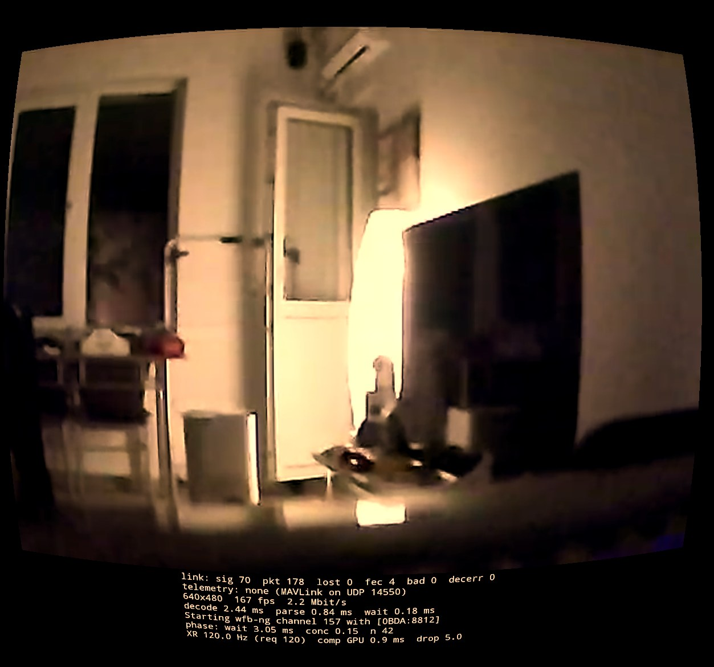
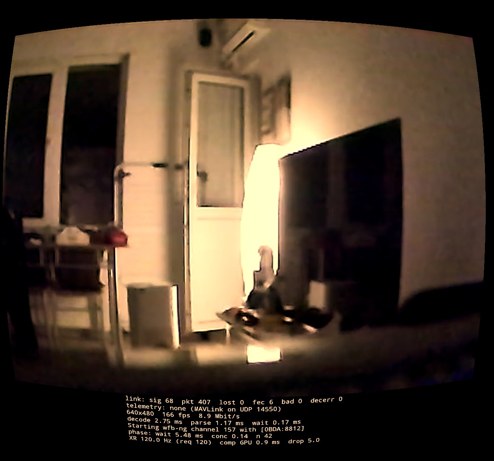

# Link operating envelope (W2): TX power × MCS × bitrate × FEC

Quest XR docs: [guide](../xr-quest.md) · [G2G budget](g2g-budget.md) · [real link](real-link.md) · [troubleshooting](troubleshooting.md) · run plan [plan-2026-09-27-optimize.md](plan-2026-09-27-optimize.md) · next tests [plan-2026-09-28-presets-quality-power-axis.md](plan-2026-09-28-presets-quality-power-axis.md)

**Goal.** For the video downlink (air unit → RTL8812AU on the Quest), find which MCS / bitrate / FEC keeps the picture
clean at which link margin, and what each costs in capture → decoded latency. The link margin is emulated by lowering
the air unit's TX power; nothing is moved (Quest on the balcony, air unit indoors, both fixed). Output: the operating
envelope and the policy table the adaptive link (W1 phase 2) will follow. Owner: session pixelpilot-xr-22 (Quest,
analysis); air-unit changes by openipc-…-3a. Runs at the resolution mode chosen by W3.

## Instruments

| What | Where | Source |
|---|---|---|
| capture → frame complete / decoded, spread, loss after FEC (lost/s, %), frames without a decoded mark | [ab_segments.py](../../scripts/quest-latch/ab_segments.py) | app RTP marks `ppxr_rtp_*`, `ppxr_frame_ready` |
| packets received over the air (data + parity), FEC repairs, still lost after FEC, RSSI (mapped best chain, plus raw RSSI / SNR per receive chain A/B from app builds after 2026-09-28) | [ab_link.py](../../scripts/quest-latch/ab_link.py) | app counters `ppxr_wfb_*` from [WfbStatsTrace.java](../../app/wfbngrtl8812/src/main/java/com/openipc/wfbngrtl8812/WfbStatsTrace.java) (one sample per ~300 ms wfb-ng stats poll) |
| **same-window data loss before FEC** (`dataFEC%`, `data_loss_pct`) = (FEC repairs + RTP gaps) ÷ (RTP received + gaps), all Quest counters in the same guarded window. **Use this one** (since 2026-09-28) | `ab_link.py` | app `ppxr_wfb_fec_rec` + `ppxr_rtp_seq`; the definition is from the link-25mbit audit, H5 §1.3 (OpenIPC repo `repos/tasks/link-25mbit-audit-2026-09-28/`) |
| pre-FEC loss = 1 − Quest rx/s ÷ air tx/s (the `preFEC%` column of the results below) | `ab_link.py` | air `tx=` (cumulative wlan0 tx_packets) on every step line. **Biased by up to ±2 points:** a guarded Quest window divided by the air's whole step, so the tail of the previous step leaks in (audit H5 §1.3). Kept for comparison with the older tables |
| **RF bit errors vs host-side (USB) loss** (link-25mbit audit T6; app builds after 2026-09-28, off by default): `ppxr_rx_crc_err` / `ppxr_rx_icv_err` / `ppxr_rx_clean` = frames per stats window that failed FCS / ICV in the radio (need `keep_corrupted`; they are counted, then dropped, so every other counter keeps its meaning); `ppxr_usb_completions` / `_empties` / `_dropped` / `_resubmit_fail` (per window), `ppxr_usb_min_armed`, `ppxr_usb_cb_max_us`, `ppxr_usb_qdepth` = devourer's RX ring telemetry (empties/completions = host starvation; dropped = frames the host discarded) | trace counters; switched per run by the app prefs `rx-diag-ring-ms` (int, e.g. 100), `rx-diag-keep-corrupted` (bool), `rx-diag-mode` (`async` / `spsc` / `reorder`), read at link start | [RxDiagPrefs.java](../../app/wfbngrtl8812/src/main/java/com/openipc/wfbngrtl8812/RxDiagPrefs.java), [RxDiag.h](../../app/wfbngrtl8812/src/main/cpp/RxDiag.h), devourer `src/RxRingStats.h` (fork `tmariovlad/devourer`, `pixelpilot-xr`) |
| air SoC temperature | `ab_link.py` | air `temp=` on every step line |
| Quest thermal status, CPU/SoC/battery °C, battery % | [quest_thermal_log.sh](../../scripts/quest/quest_thermal_log.sh) → `ab_link.py --thermal` | `dumpsys thermalservice`, `dumpsys battery` |

**The RSSI column is not dBm.** It is the app's 0–100 value = 1.25 × the raw PHY-status `gain_trsw` byte, and phydm
reads that byte as dBm + 110. So **dBm ≈ column ÷ 1.25 − 110**: column 56 ≈ −65 dBm, 64 ≈ −59, 68 ≈ −56, 72 ≈ −52
[PROVEN: `WfbngLink.cpp` `avg_rssi_int`, `SignalQualityCalculator.cpp` 0…80 → −1024…1024, phydm `rx_pwr = (gain_trsw & 0x7F) − 110`,
via the link-25mbit audit H5 §1.4]. It averages only frames that arrived. Every "RSSI" number in the tables below is
this column, not dBm (correction 2026-09-28).

Method as in [slot 3](g2g-budget.md#mcs--bitrate-at-1080p90-measured-in-one-trace-2026-09-27-slot-3): one long Perfetto
trace per run ([ab_long.sh](../../scripts/quest/ab_long.sh)), a timed loop on the air unit, 12 s steps, 2 s guard around
every switch, drift fitted on the reference state A, N = 2 per state, states alternated with A.

## Air loop contract (for openipc-…-3a)

- One line per step, written after the step's last command: `<air epoch> <label> tx=<wlan0 tx_packets> temp=<SoC °C>`;
  the END line carries `tx=` and `temp=` too (it closes the last step's TX rate). Failed commands: `<epoch> ERR …`.
- Labels: `p<power>m<MCS>b<Mbit/s>` plus `f<k><n>` when FEC differs from 4/6, e.g. `p10m4b12`, `p10m4b12f45`.
- All changes hot: MCS with `wfb_tx_cmd set_radio` (all fields resent, `get_radio` before/after), bitrate through
  waybeam's API, FEC with `wfb_setfec`, TX power with the hot mechanism 3a confirms for the 8822EU (to be named with its
  valid range; the video `wfb_tx` is not restarted).
- Order inside a switch: raise capacity before load (TX power, then MCS, then bitrate); lower load before capacity
  (bitrate, then MCS, then power).
- Stop rule: a step whose air SoC temperature keeps rising without levelling, or exceeds the board limit the OpenIPC
  project documents, ends the run; revert to the pre-run state. On the Quest: thermal status ≥ 3 (severe) or battery
  < 30 % ends the run.
- Revert at the end: the pre-run power, MCS, bitrate and FEC (1080p90 / 8000 / MCS2 / 4/6 unless W3 changed the mode).

## Plan

| Phase | What | States | Trace | Est. time |
|---|---|---|---|---|
| 0 | Install a build with `WfbStatsTrace` (built from a clean checkout of HEAD, not the shared working tree); 60 s dry run: counters present, `tx=`/`temp=` parsed | – | 60 s | 15 min |
| 1 | **Power ladder** at MCS2 / 8 Mbit/s: RSSI, pre-FEC loss and loss after FEC vs TX power, to find the cliff | A = max power; 5 levels from max to min, each N = 2 | ~4.5 min | 10 min |
| 2+3 | **Matrix with FEC** at 17 / 12 / 8 dBm (chosen from phase 1, see Results; 5 dBm adds nothing over 8) at the mode W3 picks. On-air rate = bitrate × n/k must fit the MCS: injection carries roughly 60 % of the PHY rate [INFERRED: slot 2 measured ~97 % airtime at 8 Mbit/s, FEC 4/6, MCS2], i.e. ~7.8 / 11.7 / 15.6 / 23 Mbit/s at MCS1/2/3/4. So strong FEC is paired with MCS4, and block length is compared at equal airtime (4/8 vs 8/16) and against 8/12. Longer blocks cover bursts better but wait longer to fill (K = 8 in slot 2 cost ≈ 0 ms at 640×480; K = 12 cost 3–4 ms on the OpenIPC side). | A = `m1b4f46` (6 Mbit/s on air, the most robust point, same reference in every trace so deltas compare across levels); `m2b4f46`, `m2b8f46` (today's default, 12 on air: saturated), `m2b4f48`, `m3b8f46`, `m4b8f46`, `m4b8f48`, `m4b8f816`, `m4b8f812` | ~7 min per level | 25 min |
| 3b | **Adaptive link on/off** at 17 and 8 dBm (air power fixed per run). It is a Quest pref read at start-up, so it runs with [pref_ab.sh](../../scripts/quest/pref_ab.sh) (app restart per step, guard ≥ 10 s), ABBA order ≥ 2× so a time trend cancels. The [slot 3d run](troubleshooting.md#does-the-quests-uplink-hurt-the-video-slot-3d-2026-09-27) found no effect, but a loss trend during the run masked it | on, off | ~4 min per level | 15 min |
| 4 | Analysis, envelope + policy table, docs, commit | – | – | 30 min |

About 75 min on the devices and 105 min in total. Guardian paused and `prox_close` only while a trace runs, restored
after each phase.

**Not in scope:** the Quest RTL's TX power (it only carries the uplink, which W1 owns).

## Output formats

**Envelope** (one row per power level): RSSI · pre-FEC loss at m2b8 · states with ≤ 0.1 % loss after FEC and no frames
without a decoded mark · the fastest of those (Δ capture → decoded vs m1b4) · temperatures.

**Policy table for W1 phase 2** (one row per link-quality band, measured by what the receiver can see: RSSI, FEC
repairs/s, pre-FEC loss): chosen MCS / bitrate / FEC, the switch-down and switch-up thresholds with hysteresis, and
the latency cost at that band.

## Results

### Capture caveat: streamed logcat (2026-09-28)

**Every run below from 2026-09-27 and 2026-09-28, except the T2 control, may be contaminated by the capture itself.**
The uplink logger `quest_tx_log.sh` streamed `adb logcat` over adb-over-Wi-Fi during the run. So the Quest's internal
Wi-Fi (5180 MHz, a few cm from the RTL8812AU) transmitted a burst right after every RTL uplink frame (14–51/s,
depending on the run). pixelpilot-xr-36 found this as the likely cause of T4's "uplink doubles the loss"
([uplink-t4-analysis.md](uplink-t4-analysis.md), hypothesis H1) [SPECULATION until U1 of that doc decides].
- Affected, marked at their headings: phase 2 and 3b, the adaptive range test, the power bracket, the bitrate × MCS
  grid, STBC, the 40 MHz grid, power × bitrate (incl. the MCS7 follow-up), and T4's uplink-ON steps [PROVEN: their
  link CSVs carry `quest_tx_per_s` from `quest_tx_log.sh`]. Phase 1 recorded no TX log.
- Clean: the T2 control (detached capture, `ab_detached.sh`). `quest_thermal_log.sh` also polls `dumpsys` over adb every
  5 s during all runs, a much smaller and uncorrelated load.
- **Confirmed by U1 (2026-09-28 20:10, [below](#slot-2026-09-28-2010-u1-streamed-capture-t6-rx-diagnostics-t2-quest-wi-fi-off)):** in the same run, steps with the streamed logger lost 1.51–1.84 % after FEC, steps without it 0.46–1.48 % (means 1.66 vs 0.90 %). So the absolute loss levels of the marked runs are inflated, by roughly the logger's share. Nothing is retracted. A/B verdicts compare states that were all
  captured the same way, so they may still hold, unless the contamination scales with the Quest's TX rate (which
  itself varies with the state, as in T4).
- From 2026-09-28 on, captures during a measurement are detached (`ab_detached.sh`, `stream_ab.sh`,
  `pref_ab.sh` with `CAPTURE=detached`): nothing streams over adb. Next slot: [runbook](runbook-2026-09-28-u1-t6.md).

**Phase 2: MCS × bitrate × FEC at 640×480 @ 167 fps, 17 / 12 / 8 dBm (2026-09-27 17:36–18:01, Quest on the balcony, air unit indoors).** *[Streamed-capture caveat](#capture-caveat-streamed-logcat-2026-09-28).*
- **Method.** One trace per power level ([ab_long.sh](../../scripts/quest/ab_long.sh)), 12 s steps, anchor `m1b2f46` between every state, each state N = 2 in two differently shuffled passes (N = 1 not used). A short extra run `p17b` added `m2b2f48` and `m2b3f46` at 17 dBm. Adaptive-link uplink live (~51 Quest TX/s in every step), W1 tunnel up. Build `cd5fa436`.
- **Air unit.** Every run ended without ERR or reset, at 46–48 °C, and reverted to its pre-run state. `waybeam.json` was byte-identical to its backup after ~100 live bitrate sets.
- **Quest.** Thermal status 0, CPU 54–56 °C (live HAL values), battery 96 %.
- **Step alignment.** `--fit-offset` from packets/frame at 17 and 12 dBm (+0.25 / +0.27 s, within 0.07 s of the clocks). At 8 dBm loss makes packets/frame noisy: the fit moved 0.54 s, so the measured offset (+0.341 s) was used. Both give the same deltas within 0.05 ms.
- **Data.** Per level: latency/loss [p17](data/measurements-2026-09-27-quest2-w2-480-p17.csv) · [p12](data/measurements-2026-09-27-quest2-w2-480-p12.csv) · [p8](data/measurements-2026-09-27-quest2-w2-480-p8.csv) · [p17b](data/measurements-2026-09-27-quest2-w2-480-p17b.csv); link [p17](data/link-2026-09-27-w2-480-p17.csv) · [p12](data/link-2026-09-27-w2-480-p12.csv) · [p8](data/link-2026-09-27-w2-480-p8.csv) · [p17b](data/link-2026-09-27-w2-480-p17b.csv); air step logs [p17](data/steps-2026-09-27-w2-480-p17.txt) · [p12](data/steps-2026-09-27-w2-480-p12.txt) · [p8](data/steps-2026-09-27-w2-480-p8.txt) · [p17b](data/steps-2026-09-27-w2-480-p17b.txt); Quest thermal [p17](data/thermal-2026-09-27-w2-480-p17.csv) · [p12](data/thermal-2026-09-27-w2-480-p12.csv) · [p8](data/thermal-2026-09-27-w2-480-p8.csv) · [p17b](data/thermal-2026-09-27-w2-480-p17b.csv).

Each cell: Δ capture → decoded vs the anchor in the same trace · loss after FEC · frames without a decoded mark (of ~2800 per state; the anchor has ~24 000). "On air" = bitrate × n/k.

| state (on air) | 17 dBm (RSSI 68.5) | 12 dBm (RSSI 64) | 8 dBm (RSSI 54) |
|---|---|---|---|
| `m1b2f46` anchor (3 Mbit/s) | 0 · 0.21 % · 25 (p17b: 0.18 %, 7/7145) | 0 · 0.28 % · 31 | 0 · **0.75 %** · 49 |
| `m2b2f46` (3) | **−0.43 ms** · 0.32 % · 3 | **−0.13 ms** · 0.67 % · 7 | +1.71 · 7.3 % · 43 |
| `m2b2f48` (4) | **−0.10 ms · 0.00 % · 0** (p17b) | – | +1.09 · 3.8 % · 21 |
| `m2b3f46` (4.5) | +0.06 · 0.29 % · 1 (p17b) | – | +2.16 · 8.5 % · 41 |
| `m2b4f46` (6) | +0.72 · 0.47 % · 0 | +1.04 · 1.86 % · 3 | +2.81 · 10.9 % · 38 |
| `m2b4f48` (8) | +1.48 · 0.07 % · 1 | +1.55 · 0.66 % · 2 | +2.39 · 5.8 % · 21 |
| `m3b4f46` (6) | +0.37 · 0.99 % · 1 | +2.42 · 11.9 % · 44 | +2.46 · 13.5 % · 48 |
| `m4b4f46` (6) | +1.40 · 7.1 % · 15 | +1.78 · 10.3 % · 36 | – |
| `m4b4f48` (8) | +0.93 · 3.6 % · 8 | +1.20 · 6.2 % · 28 | – |
| `m4b4f816` (8) | +2.97 · 1.05 % · 3 | +3.24 · 2.85 % · 10 | – |
| `m4b8f46` (12) | +2.85 · 9.2 % · 31 | +3.61 · 12.1 % · 69 | – |

- **Loss before FEC depends on the MCS, not on the power alone** [PROVEN: link data]. At the same RSSI 68.5 it is ~5 % at MCS1–3 and ~15 % at MCS4. At RSSI 64 it is ~7–8 % at MCS1–2 and ~20 % at MCS3/4. At RSSI 54 it is 9 % at MCS1 and ~20 % at MCS2/3. MCS4 is not usable at this distance, and MCS3 only at 17 dBm.
- **Low bitrate is the fastest here too.** `m2b2` is 1.15 ms ahead of `m2b4` at 17 dBm, as slot 2 found at 640×480 (bitrate 2000 = −4.5 ms vs 8000).
- **FEC 4/8 costs almost nothing at low bitrate and removes the residual loss.** At 17 dBm `m2b2f48` loses 0 packets (4/6: 0.32 %) for +0.33 ms. At 8 dBm it halves the loss (7.3 % → 3.8 %).
- **A longer block covers bursts, but costs about 2 ms.** At equal airtime (`m4b4`) 8/16 loses 1.05 % against 3.6 % for 4/8, for +2.0 ms of block fill [PROVEN: data].
- **Latency deltas at 8 dBm are measured on the frames that survived.** Frames that complete through FEC repairs arrive late, so there Δ mostly reflects loss.
- **Picture quality is not assessed.** At 167 fps, 2 Mbit/s is ~12 kbit per frame. Whether that looks acceptable has to be judged by the user in the headset [SPECULATION until then].

**Operating envelope and policy table for the adaptive link (W1 phase 2).** This covers 640×480 @ 167 fps, this geometry and FEC k = 4 unless stated. The band edges are what the receiver can see: RSSI on the app's 0–100 scale and loss before FEC at the current MCS.

**Policy: two states.** `m2b2f48` dominates `m2b2f46` wherever MCS2 holds. At 12 dBm, in the same trace, it lost 0.24 % against 0.60 % after FEC for +0.16 ms. At 17 dBm it lost 0 % against 0.32 %. So the MCS2 row keeps only 4/8, and the policy is `m2b2f48` above a score of ~1600 and `m1b2f46` below it. The threshold sits between the 12 dBm point (score ~1640, where `m2b2f48` loses 0.24 %) and the 8 dBm point (~1540, where it loses 3.8 % against 0.75 % for `m1b2f46`) [INFERRED: from the measured points; the exact edge and its hysteresis are for the closed-loop check].

| score (≈ RSSI column) | seen at | use | measured loss after FEC | Δ latency vs `m1b2f46` |
|---|---|---|---|---|
| ≥ ~1600 (≥ ~60) | 17 dBm (~1685), 12 dBm (~1640) | `m2b2f48` | 0 % (17 dBm) · 0.24 % (12 dBm) | −0.1 ms (17) · +0.2 ms (12) |
| < ~1600 | 8 dBm (~1540) | `m1b2f46` | 0.75 % (8 dBm); `m2b2f48` there: 3.8 % | 0 |
| far below (5 dBm) | – | still `m1b2f46`; nothing at 480p kept loss < 1 % [INFERRED: phase 1 at 5 dBm ≈ 8 dBm] | – | – |

For more picture at a good margin, `m2b3f46` (0.29 %) and `m2b4f46` (0.47 %, +0.7 ms) held at 17 dBm. They are not part of the policy.

- **`score` vs the RSSI column.** The adaptive-link message sends `score = map(quality, −1024…1024 → 1000…2000)` in fields 2, 3 and 6 ([WfbngLink.cpp:534,571-579](../../app/wfbngrtl8812/src/main/cpp/WfbngLink.cpp#L534)). The RSSI column here is the app's `avg_rssi` = `map(quality, −1024…1024 → 0…100)` ([WfbngLink.cpp:469](../../app/wfbngrtl8812/src/main/cpp/WfbngLink.cpp#L469)). Both come from the same `quality` = `map(raw RSSI 0…80 → −1024…1024)` ([SignalQualityCalculator.cpp:89](../../app/wfbngrtl8812/src/main/cpp/SignalQualityCalculator.cpp#L89)), so **score = 1000 + 10 × RSSI column** (= 1000 + 12.5 × raw) [PROVEN: code]. Earlier values of ~1850/1800/1675 took the RSSI column for the raw value.
- **Loss before FEC is not in the message.** It carries only FEC repairs/s (field 4) and lost/s (field 5). For now the air unit estimates it from its own `tx_packets` against what the ground reports. Sending the Quest's measured pre-FEC loss from the app is a later improvement.

- **Switch down** to MCS1 when the score falls below ~1600, or when loss before FEC at MCS2 passes ~10 %. At MCS2, 8 % before FEC still gave 0.24 % after FEC, and 20 % broke it [INFERRED: from the points above].
- **Switch up** to MCS2 only with margin above ~1600. The score moved ~45 points between 17 and 12 dBm and ~100 between 12 and 8 dBm. Hysteresis and time constants are checked in closed loop by the receiver's author and live by the adaptive-range test below [SPECULATION until then].
- **Pending:** the user's picture-quality check at 2–4 Mbit/s.

**STBC on/off A/B: does STBC put the video on both air TX chains? (2026-09-28 11:45–11:48, O82b stage 4a.1, 480p167 race, `m2b2f48`, 12 dBm).** *[Streamed-capture caveat](#capture-caveat-streamed-logcat-2026-09-28).*
- **Question.** In 1SS without STBC the RTL8822EU transmits on path A only (hal_dm.c:1488-1513). If STBC uses both chains, S1 should be clearly better than S0 (≳ 3 dB RSSI or clearly lower pre-FEC). If they are equal, the video goes out on path A either way.
- **Method.** One 240 s trace ([ab_long.sh](../../scripts/quest/ab_long.sh)), air alink + vmoded stopped, 6 steps of 30 s in the order `S1 S0 S0 S1 S1 S0` (N = 3 per state, alternating). The air read back the radio after every step, and `readback=1` at the end. Quest on the balcony, same geometry as the bitrate grid. Offset Quest − air = −0.232 + 0.273 = +0.041 s. Air at 40 °C throughout.
- **Data.** [air step log](data/air-stbc-2026-09-28.txt) · [latency/loss](data/measurements-2026-09-28-quest2-stbc.csv) · [link](data/link-2026-09-28-stbc.csv) · [Quest thermal](data/thermal-2026-09-28-stbc.csv).

| state | RSSI column (best chain) | pre-FEC | FEC rec/s | loss after FEC | undecoded | Δ decoded |
|---|---|---|---|---|---|---|
| S1 (STBC on), 3 steps | **69.0** (69.0 / 69.0 / 69.0) | **3.3 %** (3.1 / 3.9 / 2.9) | 7.0 | **0.00 %** | 0 | 0 (baseline) |
| S0 (STBC off), 3 steps | 60.2 (59.8 / 61.5 / 59.4) | 5.4 % (5.3 / 5.8 / 5.0) | 12.8 | 0.18 % | 3 | +0.21 ms |

- **Verdict: STBC is clearly better, so it uses both TX chains** [PROVEN: every S1 step beats every S0 step on RSSI, pre-FEC and loss after FEC, in an alternating order, [link CSV](data/link-2026-09-28-stbc.csv) + [measurements CSV](data/measurements-2026-09-28-quest2-stbc.csv)].
  - The RSSI column rises by 8.8, which is about +7 dB raw (the column is 1.25 × raw) and +88 alink score points [INFERRED: from the score mapping, see the policy section below].
  - Pre-FEC loss drops from 5.4 % to 3.3 % and FEC repairs from 12.8/s to 7.0/s. Loss after FEC goes from 0.18 % to 0.
  - The latency cost of turning STBC off is +0.21 ms decoded, from the extra FEC recovery [INFERRED: packets/frame unchanged, 1.79 vs 1.81].
- **Consequence.** Keep STBC on (it is the current default, [HANDOFF](HANDOFF.md)). Without STBC, 1SS video leaves on path A only [INFERRED: code path above plus this gap]. At the time of this test the app exported only the best-chain RSSI, so the trace cannot tell which Quest chain carried the signal. Since then the app writes `ppxr_wfb_rssi_a/_b` and `ppxr_wfb_snr_a/_b` per receive chain, and [ab_link.py](../../scripts/quest-latch/ab_link.py) shows them as `rssi A/B` and `snrA/B dB`. They are tested on the host, not yet on the headset.

### Air TX power ceiling 2026-09-28 22:14–22:30: 12 → 31 dBm at MCS2, received power per Quest chain

Question (O115 §12, the stop rules, and the user's "up to the hardware limit"): where does more requested power stop reaching the Quest? Test only; the boot power stays 12 dBm.
- **Method.** Air race-like: MCS2, 4 Mbit/s, FEC 4/8, 20 MHz 157, alink as at boot. Steps of 60 s, rising ≤ 3 dB at a time; `iw` and the TXAGC index read back per step. Three runs: 12/20/23/24/26/28/12, then 28/29/30, then 30.5/31/"31.75" (applied as 31, the effective driver maximum)/12. Air ≤ 43 °C, DPS 0.422 A at 12 dBm → 0.700 A at 31 dBm. Coordinator's air log with the indices and currents: [air-pwr-ceiling](data/air-pwr-ceiling-2026-09-28.txt).
  - Quest: detached capture, same desk position as R5–R7, `TRACE LOSS: none`. The first build with per-chain counters: `rssi_a/b` = the raw `gain_trsw` average (≈ dBm + 110, rounded to whole units per window), `snr_a/b` in dB.
- **Data.** Steps [run 1](data/steps-2026-09-28-pwr-ceiling-run1.txt) · [runs 2–3](data/steps-2026-09-28-pwr-ceiling-run23.txt); link [run 1](data/link-2026-09-28-pwr-ceiling-run1.csv) · [runs 2–3](data/link-2026-09-28-pwr-ceiling-run23.csv); link_audit [run 1](data/audit-2026-09-28-pwr-ceiling-run1.txt) · [runs 2–3](data/audit-2026-09-28-pwr-ceiling-run23.txt).

| requested dBm | TXAGC idx A / B | chain A raw (≈ dBm) | chain B raw (≈ dBm) | SNR A / B dB | p_data | post-FEC |
|---|---|---|---|---|---|---|
| 12 | 53 / 44 | 55.0 (−55) | 51.0 (−59) | 17.0 / 17.1 | 2.20 % | 0 |
| 20 | – | 62.2 (−48) | 59.5 (−51) | 16.8 / 17.3 | 2.07 % | 0 |
| 23 | – | 65.0 (−45) | 62.0 (−48) | 17.5 / 17.5 | 2.03 % | 0 |
| 24 | – | 65.8 (−44) | 62.5 (−48) | 17.0 / 17.3 | 2.16 % | 0 |
| 26 | – | 65.8 (−44) | 63.2 (−47) | 17.0 / 17.1 | 1.89 % | 0 |
| 28 (runs 1, 2) | 117 / 108 | 67.0 / 66.9 (−43) | 64.0 (−46) | 17.0–17.3 | 1.99–2.22 % | 0 |
| 29 | 121 / 112 | 67.0 (−43) | 64.0 (−46) | 17.3 / 17.1 | 2.11 % | 0 |
| 30 | 125 / 116 | 67.0 (−43) | 64.4 (−46) | 17.0 / 17.0 | 2.15 % | 0 |
| 30.5 | 127 / 118 | 67.0 (−43) | 65.0 (−45) | 17.0 / 17.0 | 2.13 % | 0 |
| 31 (and "31.75") | 127 / 120 | 67.0 (−43) | 64.0–64.5 (−46) | 17.0 / 17.0 | 2.12–2.15 % | 0 |
| 12 (after each run) | 53 / 44 | 55.0 (−55) | 51.6–51.9 (−58) | 16.5–16.9 | 1.98–2.12 % | 0–0.01 % |

- **At the Quest, received power follows the request almost 1:1 up to 20 dBm, gains ~2.5–3 dB from 20 to 23 dBm, and is flat from ~24–26 dBm to 31 dBm (+1–2 dB over the last 5–7 dB of request)** [PROVEN: per-chain counters, both chains, 3 runs; the return to 12 dBm reads the same as the start].
  - The TXAGC index keeps rising 4 per dB up to its register maximum: 127 on path A from 30.5 dBm, path B to 120 at 31 dBm.
  - The DPS current keeps rising too, 0.565 A at 23 dBm → 0.700 A at 31 dBm.
- **SNR stays at 16.5–17.5 dB at every power level**, while RSSI changes by 12 dB [PROVEN]. What limits it scales with the signal: transmitter distortion (EVM), multipath, or the receiver's own limit, not thermal noise or an outside source [INFERRED]. So at this position more power does not buy SINR for MCS7. That fits the MCS7 cliff at 21–23 dBm and R5/R7's steady ~0.5 % after FEC.
- **Caveat: which end saturates is not proven.** At ≈ −43 dBm the flat top could be the air's power amplifier compressing (the rising DPS current fits that) or the Quest RTL's receiver/AGC saturating. The per-chain counter is rounded to whole units, so its steady 67.0 on chain A says nothing either way [INFERRED].
  - **Discriminator:** the same power ladder with the Quest far away (RSSI ≈ −70 dBm). If the curve still flattens at ~24 dBm, it is the PA; if it keeps rising, it was the receiver. This needs the user to place the headset.
- MCS2 lost nothing after FEC at any power. p_data 1.9–2.2 % is flat with power, so the pre-FEC floor at MCS2 is not a matter of received power here.

### External 102.4 ms transmitter identified 2026-09-28 22:47: a neighbour's AP on ch157

Question (OpenIPC beacon-rhythm B1/B4): the loss spike locked at 9.766 Hz comes from a transmitter that is neither the air nor the Quest. Its phase stays continuous across Quest relaunches and air reboots. Who is it?
- **Method.** The air unit itself scanned in managed mode (runtime only): wfb/alink stopped, `iw dev wlan0 scan` over all channels, then a scan of 5745–5825 MHz, then a reboot back to wfb. The driver regdomain is US (chplan 0x76), so UNII-3 is scanned. The PC's `netsh` (EU) never lists 149–165, which is why it had "seen nothing".
- **Data.** [scan summary + the full ch157 entries](data/air-scan-ch157-2026-09-28.txt).
- **Result** [PROVEN: scan]:
  - The only BSSs on 149–165 are two on **ch157**, both from one radio: `b0:8b:92:ee:10:b9` "**Staff - 5GHz**" and `b2:8b:92:9e:10:b9` (hidden SSID).
  - Both beacon every **100 TU = 102.4 ms** and arrive at −90/−91 dBm at the air.
  - Channels **149, 153, 161 and 165 had no BSS**. **Correction 2026-09-28 23:20:** "no BSS" is true for their primaries only. The neighbour's AP is VHT 80 MHz, center segment 155, primary 157 [PROVEN: [scan](data/air-scan-ch157-2026-09-28.txt), both BSSs], so its band covers 149/153/157/161 (5735–5815 MHz). Beacons go out only on 157, but its 80 MHz traffic also covers 161. **Only 165 (5815–5835 MHz) lies wholly outside it.**
  - The user's own networks are Zeul36 on ch36 and Zeul37 on ch48. The spare WiFiLink HD air unit was not seen.
- **Reading** [INFERRED]:
  - A neighbour's AP beacons on our channel. That is the external 102.4 ms source of B1/B4 (~6–13 % of lost packets, 12–26 % of gaps).
  - Two SSIDs on one radio give two beacon frames per TBTT, which fits B1's ~2.2 lost packets per gap.
  - The fix on our side is a channel with no BSS (149/153/161/165). The next test is R3: an A/B of 157 against a free channel, checking that the 9.766 Hz lock disappears. (Correction 2026-09-28: of those, only 165 is outside the neighbour's 80 MHz; see above and R3 below.)

### Above 25 Mbit/s 2026-09-28 23:50–23:59: 1SS with FEC 8/10, and 2SS (HT MCS12/13) at 1080p90, 17 dBm, ch157

Question (the user asked for more than 25 Mbit/s): can the link carry 30–40 Mbit/s, and does the Quest decode two spatial streams?
- **Method.** Air: `bitrate_grid.sh` (48d0ccbc), 60 s steps, alink off, TBTT fix on.
  - G1: 1SS with STBC (`-S 1`).
  - G2: 2SS without STBC (`-S 0`; HT MCS12 = 2 × 16-QAM 3/4, 78 Mbit/s PHY; MCS13 = 2 × 64-QAM 2/3, 104 Mbit/s).
  - The grid skips the higher bitrates of an MCS once a step drops more than 50 packets on the air. `enc_kbps` matched the request at every step (25–40 Mbit/s, 90 fps).
  - Quest: detached capture, `TRACE LOSS: none`, latency against `m7b25f46`'s drift line.
- **Data.** [air log](data/air-grid-above25-2026-09-28.txt) · [steps](data/steps-2026-09-28-grid-above25.txt) · [latency](data/measurements-2026-09-28-quest2-grid-above25.csv) · [link](data/link-2026-09-28-grid-above25.csv) · [link_audit](data/audit-2026-09-28-grid-above25.txt).

| step | air drop | p_data | post-FEC | loss runs/s | latency last / p95 / decoded (ms) | raw A / B | SNR A / B |
|---|---|---|---|---|---|---|---|
| m7b25f46 | 0 | 3.03 % | 0.49 % | 4.7 | 1.55 / 4.16 / 4.33 | 59 / 55 | 19.0 / 19.4 |
| m7b30f46 | 6384 | 9.46 % | 4.82 % | 31.6 | 72.0 / 80.2 / 76.1 | 59 / 55 | 19.0 / 19.5 |
| m7b25f810 | 0 | 2.88 % | 0.65 % | 7.5 | −0.45 / 3.22 / 2.41 | 59 / 55 | 19.0 / 19.5 |
| **m7b30f810** | 0 | 2.92 % | **0.62 %** | 8.2 | 3.53 / 10.16 / 6.40 | 59 / 55 | 19.0 / 19.5 |
| **m12b25f46** (2SS) | 0 | 3.27 % | **0.73 %** | 7.6 | **0.40 / 3.25 / 3.45** | 55 / 51.5 | 18.5 / 19.0 |
| m12b30f46 (2SS) | 0 | 3.39 % | 0.82 % | 10.1 | 15.7 / 41.6 / 18.9 | 55 / 51 | 18.5 / 19.0 |
| m12b35f46 (2SS) | 14448 | 8.35 % | 8.75 % | 47.6 | 66.9 / 71.6 / 71.1 | 55 / 51 | 18.9 / 19.3 |
| **m13b35f46** (2SS) | 0 | 3.89 % | **1.48 %** | 20.7 | 6.89 / 16.4 / 11.0 | 55 / 51.5 | 18.5 / 19.0 |
| m13b40f46 (2SS) | 14384 | 7.05 % | 8.23 % | 69.3 | 57.7 / 59.8 / 64.7 | 55 / 51 | 18.5 / 19.0 |

- **The Quest decodes 2SS** [PROVEN: m12/m13 steps complete at 90 fps with ~0.7–1.5 % loss after FEC]. This is the first 2SS run on this link. Per-chain RSSI reads ~4 dB lower than 1SS with STBC; SNR is the same.
- **Above 25 Mbit/s, the best points at this position** [PROVEN: this run, N = 1 per step]:
  - **m7b30f810** (30 Mbit/s, 1SS, FEC 8/10): 0.62 % after FEC, +2 ms mean, p95 10 ms;
  - **m13b35f46** (35 Mbit/s, 2SS): 1.48 %, +5.3 ms, p95 16 ms.
  - Neither is clean (> 0.1 % after FEC).
- **m12b25f46 is the lowest-latency 25 Mbit/s point** (~1.2 ms below m7b25f46; a higher PHY rate) at 0.73 % after FEC.
- **FEC 8/10 instead of 4/6 at 25 Mbit/s: −2 ms latency** (last −0.45 vs 1.55 ms; p95 3.2 vs 4.2 ms) for +0.16 points after FEC. At 30 Mbit/s it is what keeps the air from dropping (drop 0 vs 6384).
- **Any step where the air drops is unusable** (+45–70 ms, 5–19 % RTP lost). m12b30f46 dropped nothing but already queued (+14 ms, p95 42 ms).
- **Not tested** (the grid's skip rule is per MCS, not per FEC): m7b35/40f810, m12b30f810, m13b40f810. With FEC 8/10, some of the dropped points could fit.
- Caveat: one run, N = 1 per point, no alternation. Treat the ranking between close points (m7b25f810 vs m7b30f810 vs m12b25f46) as provisional.

### R3' 2026-09-28 23:27–23:47: ch157 vs ch165 (outside the neighbour's 80 MHz) at 25 Mbit/s

The same method as R3 below: a shared clock schedule, `m7b25f46`, 17 dBm, 1080p90, TBTT fix on, 8 × 150 s, order 157 165 165 157 157 165 165 157, the first 15 s after each switch excluded, `TRACE LOSS: none`. Air: drop 0 in every step, the same `inj` per step.
- **Data.** [air log](data/air-r3b-2026-09-28.txt) · [steps](data/steps-2026-09-28-r3b.txt) · [link_audit](data/audit-2026-09-28-r3b.txt) · [link](data/link-2026-09-28-r3b.csv) · [loss lock per channel](data/coincidence-2026-09-28-r3b.txt) · [tu_pause R3 + R3'](data/tu-pause-2026-09-28-r3-r3b.txt).

| channel (steps) | p_data | post-FEC | loss runs/s | FEC repairs/s | raw A / B | SNR A / B dB | 9.766 Hz lock of losses |
|---|---|---|---|---|---|---|---|
| 157 (4 × 150 s) | 2.92–3.00 % | 0.41–0.50 % | 4.2–4.8 | 57.8–58.7 | 59 / 55 | 16.5–19.5 | **Z = 2.0 (not locked)** |
| 165 (4 × 150 s) | 2.58–2.74 % | 0.50–0.55 % | 5.4–6.0 | 48.8–51.3 | 52.6–53.0 / 51–52 | 17.0–21.0 | **Z = 70.9 (locked)** |

- **Moving to a channel outside the neighbour's band does not lower the loss after FEC** [PROVEN: ABBA×2]. 165, like 161, repairs ~15 % fewer packets before FEC (p_data 2.58–2.74 % vs 2.92–3.00 %), yet loses as much or slightly more after it, in more runs per second. Its RSSI is ~6 dB (A) / ~4 dB (B) lower than 157.
- **The 102.4 ms loss lock is absent on 157 and present on 165 (Z = 70.9) and 161 (Z = 42.8, R3)** [PROVEN: coincidence files]. That is the reverse of "the neighbour's beacons on 157 cause it".
  - It is not the air's TX pause: with the TBTT fix on, no step on any channel shows the pause (Z(pause) ≤ 3.3, latency fold ≤ 0.35 ms) [PROVEN: tu_pause file].
  - Its source is **unknown** [SPECULATION]. Candidates:
    - another beaconing transmitter near 161/165 that the air's scan could not see from where the air sits;
    - on 157, the air's CCA hearing the neighbour's beacons and deferring (so no collision), which it cannot do on other channels;
    - something tied to the Quest's RTL on those channels.
  - A scan from the Quest's position, or from the GS on 161/165, would help.
- **Consequence:** stay on 157. None of the three channels gives lower loss after FEC, and 157 has the strongest signal here.
- The Quest's prefs restore after R3' failed its read-back again. The cause is a race: `am force-stop` returns before the app has exited, and the exiting app flushed its prefs over our write. `quest_adb.force_stop()` now waits until `pidof` is empty. It is used by `set_bw.py` and `pref_ab.sh` (tests `test_force_stop_*`), but not yet verified live.

### R3 2026-09-28 22:58–23:18: ch157 vs ch161 at 25 Mbit/s (both inside the neighbour's 80 MHz)

Question: does moving off the neighbour's primary channel remove the 102.4 ms loss lock?
- **Method.**
  - Air and Quest both switched channel on one clock schedule: [pref_ab.sh](../../scripts/quest/pref_ab.sh) with `START_AT` sets the Quest pref `wifi-channel` and relaunches; the air switches at the same PC epochs. 8 × 150 s, order 157 161 161 157 157 161 161 157.
  - Air: `m7b25f46`, 17 dBm, 1080p90, alink stopped, **TBTT fix active (0x550 = 0x10)**, drop 7 only at the first switch, the same `inj` per step.
  - Quest: detached capture, steps on the Quest clock, the first 15 s after each switch excluded, `TRACE LOSS: none`.
- **Caveat found afterwards:** ch161 is **inside** the neighbour's VHT 80 MHz band (see the correction above). So R3 compares the neighbour's primary with another channel of the same neighbour, not with a clean channel. R3' (157 vs 165) repeats it against 165.
- **Data.** [air log](data/air-r3-2026-09-28.txt) · [steps](data/steps-2026-09-28-r3.txt) · [link_audit](data/audit-2026-09-28-r3.txt) · [link](data/link-2026-09-28-r3.csv) · [loss lock per channel](data/coincidence-2026-09-28-r3.txt).

| channel (steps) | p_data | post-FEC | loss runs/s | FEC repairs/s | raw A / B | SNR A / B dB | 9.766 Hz lock of losses |
|---|---|---|---|---|---|---|---|
| 157 (4 × 150 s) | 2.91–2.97 % | 0.42–0.47 % | 4.0–4.7 | 57.4–59.2 | 58–60 / 55 | 15.1–19.4 | **Z = 7.4 (not locked)** |
| 161 (4 × 150 s) | 2.43–2.73 % | 0.42–0.56 % | 4.6–5.7 | 46.8–51.7 | 57 / 51 | 15.5–17.9 | **Z = 42.8 (locked)** |

- **Before FEC 161 is better in every step** (p_data −0.2 to −0.5 points, ~10 fewer repairs/s), although its RSSI is 1–4 dB lower [PROVEN: ABBA×2]. **After FEC the two channels are equal** [PROVEN].
- **With the TBTT fix on, ch157 no longer shows the 102.4 ms loss lock (Z = 7.4). ch161 does (Z = 42.8)** [PROVEN: coincidence file].
  - Two readings, not separated yet [SPECULATION]. (a) Much of the strong lock seen in U1/T2' (Z 73–219, TBTT pause on) came from the air's own TBTT window rather than from the neighbour's beacons. (b) On 161 the neighbour's 80 MHz traffic that follows each beacon (or DTIM) lands on our channel.
  - R3' (157 vs 165, TBTT fix on in both) separates them. On 165 the lock should be gone and loss lower, if the neighbour's traffic matters.
- The Quest's prefs restore after R3 failed its read-back once (the app was likely still exiting), then succeeded after an explicit force-stop and was re-verified after the XR restart.

### R7 + R5 2026-09-28 21:45–22:13 at 1080p90 25 Mbit/s, 17 dBm: the TBTT pause off at full rate; MCS6 short GI vs MCS7 long GI

Same Quest position as R6 (RSSI column 74; raw A 59 / B 55 ≈ −51 / −55 dBm; SNR 17.1–17.5 dB on both chains in R5). Air: 1080p90, 25 Mbit/s, FEC 4/6, 17 dBm, 20 MHz 157, STBC 1, LDPC 1, alink stopped, drop = 0 in every step, the same `inj` per step. Quest: detached capture, `TRACE LOSS: none`. Analysis: [tu_pause.py](../../scripts/quest-latch/tu_pause.py), [link_audit.py](../../scripts/quest-latch/link_audit.py), [ab_segments.py](../../scripts/quest-latch/ab_segments.py).
- **Data.** Air logs: [R5](data/air-r5-2026-09-28.txt) · [R7](data/air-r7-2026-09-28.txt). Steps: [R5](data/steps-2026-09-28-r5.txt) · [R7](data/steps-2026-09-28-r7.txt). tu_pause: [R5](data/tu-pause-2026-09-28-r5.txt) · [R7](data/tu-pause-2026-09-28-r7.txt). link_audit: [R5](data/audit-2026-09-28-r5.txt) · [R7](data/audit-2026-09-28-r7.txt). R5 latency: [measurements](data/measurements-2026-09-28-quest2-r5.csv), per chain: [link](data/link-2026-09-28-r5.csv).

**R7: `EN_BCN_FUNCTION` (0x550 bit 3) on vs off, `m7b25f46`, 8 × 60 s, ABBA×2.** Latency is against the drift line of the "off" steps.

| state | latency fold at 102.4 ms | Z(pause) | pauses/cycle | latency mean | latency p95 | p_data | post-FEC |
|---|---|---|---|---|---|---|---|
| on (3 steps; the first, just after the 1080p90 setup, is left out: p95 31 ms) | 3.08–3.21 ms | 322–333 | 1.14–1.20 | 2.68–2.74 ms | 6.42–6.46 ms | 2.88–3.09 % | 0.42–0.52 % |
| off (4 steps) | 0.35–0.39 ms | 1.0–2.1 | 0.61–0.63 | 1.54–1.66 ms | 4.13–4.58 ms | 2.82–2.99 % | 0.40–0.51 % |

- **At 25 Mbit/s, clearing `EN_BCN_FUNCTION` lowers frame-complete latency by ~1.1 ms mean (2.71 → 1.60 ms) and ~2.0 ms at p95 (6.44 → 4.40 ms), and removes the 102.4 ms teeth (~3.1 → ~0.36 ms). Loss is unchanged** [PROVEN: every off step beats every on step on fold, mean and p95; loss overlaps].
  - This is larger than B4's estimate (+0.8 ms mean). With the pause present the video queue drains after every pause, and at 25 Mbit/s there is more to drain than at 2 Mbit/s (R6: ≈ 0.1 ms).
  - The 0.61–0.63 "pauses"/cycle left in the off steps are ordinary inter-frame gaps (no phase lock).
- **Update 2026-09-28 ~22:40: deployed persistently (fix (a), user-approved).** `/opt/linkmode/linkmode-air.sh` (md5 `0fd461b6`, base `47024327`) clears bit 3 of 0x550 after every switch to monitor, and logs the change to `/tmp/linkmode-bcn.log`. Checked on the device [PROVEN: coordinator's air session]: without a reboot, `bcn_off 0x550 0x18 -> 0x10`; after a reboot, the same line (so it catches the boot AP phase), with read_reg 0x550 = 0x10 and wfb, the tunnel and alink up. Its effect is R7 above. Proposal, diff and revert: OpenIPC repo `repos/tasks/link-25mbit-audit-2026-09-28/beacon-rhythm/fix-a/` (919c075, deploy record 3b00e81); air state in [HANDOFF](HANDOFF.md).

**R5: MCS7 long GI (`m7L`) vs MCS6 short GI (`m6S`), both 65 Mbit/s PHY, 8 × 120 s, ABBA×2** (TBTT pause on in both).

| state | p_data | post-FEC | loss runs/s | RTP lost | latency mean | latency p95 | decoded |
|---|---|---|---|---|---|---|---|
| m7L | 2.93–2.97 % | 0.48–0.51 % | 4.5–4.7 | 1.87–1.96 % | 2.53–2.93 ms | 6.21–7.47 ms | 5.31–5.71 ms |
| m6S | 2.61–2.74 % | 0.28–0.34 % | 2.8–3.3 | 1.10–1.32 % | 3.34–3.57 ms | 8.07–9.68 ms | 5.96–6.17 ms |

- **m6S loses ~40 % less after FEC but is ~0.7 ms slower in mean latency and ~2 ms slower at p95** [PROVEN: every m6S step beats every m7L step on loss and is behind on latency].
  - The PHY rate is the same, so the latency cost has no mechanism yet [SPECULATION: something on the air's TX path at short GI; worth a driver check].
  - **Update 2026-09-28 (OpenIPC B6, 6d1ad23, `beacon-rhythm/b6_packet_spacing_out.txt`):**
    - "Same PHY" is not exact at 1428-byte packets. With LDPC + STBC, the TXTIME rules give MCS7 LGI 46 symbols = 184 µs and MCS6 SGI 50 symbols = 180 µs, so m6S should be 4 µs **shorter**.
    - On the Quest, the median inter-packet spacing inside frame bursts is **~4 µs longer** with m6S: 275.6–276.2 vs 271.8–272.1 µs, in every step with no overlap. The frame spread is +0.12 ms [PROVEN: ab_r5.pftrace].
    - Only ~0.12 ms of the ~0.75 ms comes from transmit time. The rest is queueing at the frame's first packet, because m6S runs closer to the ~96–97 % airtime ceiling [INFERRED].
    - The 8822EU TX descriptor path is excluded: no rate fallback, and the radiotap flags pass unchanged [PROVEN: driver source].
    - Why each packet takes longer with SGI is still open. The next test is MCS6 long GI, then a packet-size sweep and a second RX on .208.
    - Decision unchanged: stay on m7L.
  - Neither is clean at 25 Mbit/s here (post > 0.1 %).
- **Tool fix found here:** `ab_segments.frames_from_packets` merged packets that carried the same RTP timestamp ~205 s apart into one "frame" (10 of ~9944 frames in one step), which showed up as a fake +52 ms. A packet more than 1 s after its frame's first packet now starts a new frame. Regression test: `test_a_repeated_rtp_timestamp_long_after_is_a_new_frame`. No earlier result is affected: a scan of the 18 local traces behind this document's 2026-09-27/28 results (grids, pwrx, mcs7pwr, range, bracket, T4, T2, slot 2, R6, R7, phase 2/3b) found 0 such repeats; only R5 had them [PROVEN: scan run 2026-09-28 on `scripts/quest/out/ab_*.pftrace`].

### R6 2026-09-28 21:32: the air's 100 TU TX pause is the TBTT prohibit window

Question (OpenIPC beacon-rhythm audit, B4 + the coordinator's R1 register read): does the air's ~3.7 ms TX pause every 102.4 ms come from the RTL8822EU's TBTT prohibit window? It would come from `EN_BCN_FUNCTION` left set from the AP phase at boot (0x550 = 0x18), with a hold of 0x64 × 32 µs (0x540 = 0x80006404).
- **Method.** Air race 480p167 2 Mbit, 12 dBm, 157/20. Runtime register writes on the air, each read back, 9 × 60 s: base / hold0 (0x541 → 0) / base / hold0 / base / bcnoff (0x550 → 0x10) / base / bcnoff / base; reverted at the end.
  - Quest: detached capture ([ab_detached.sh](../../scripts/quest/ab_detached.sh)), nothing streaming, `TRACE LOSS: none`. Offset Quest − air = +0.616 + 0.336 = +0.952 s.
  - Analysis: [tu_pause.py](../../scripts/quest-latch/tu_pause.py) (new, tested). It uses B4's pause definition (arrival gap 3–4.6 ms with no sequence number missing), fits the phase per step (it moved at the air reboot), and folds the frame latency at 102.4 ms.
- **Data.** [air log](data/air-r6-2026-09-28.txt) · [steps](data/steps-2026-09-28-r6.txt) · [tu_pause output](data/tu-pause-2026-09-28-r6.txt) · [link_audit](data/audit-2026-09-28-r6.txt).

| state (steps) | latency fold at 102.4 ms (max − min of 16 phase bins) | latency p95 | latency mean | Z(pause) at 102.4 ms | loss |
|---|---|---|---|---|---|
| base (5 × 60 s) | **1.07–1.54 ms** | 3.39–6.11 ms | 1.11–1.32 ms | 1.0–8.0 | 0–10 pkts |
| hold0 (2 × 60 s) | **0.27–0.38 ms** | 3.26–3.65 ms | 1.05–1.14 ms | 0.3 | 0 |
| bcnoff (2 × 60 s) | **0.22–0.23 ms** | 3.20–3.24 ms | 1.08–1.14 ms | 0.4–0.8 | 0–3 |

- **Both register changes remove the 102.4 ms latency teeth** [PROVEN: every base step's fold is ≥ 1.07 ms, every hold0/bcnoff step's is ≤ 0.38 ms, alternating order]. So the TBTT prohibit window, armed by the leftover `EN_BCN_FUNCTION`, is the air's periodic TX pause.
- At 2 Mbit the gain in mean latency is small (≈ 0.1 ms), and the p95 drops by up to ~3 ms in the base steps with the largest teeth.
  - The pause count itself cannot separate the states here: at 167 fps × ~2 packets/frame the ordinary inter-frame gaps fall in the same 3–4.6 ms range (25–34 gaps/s everywhere). Only their phase lock differs.
  - At 25 Mbit (B4: +0.8 ms mean, +3.1 ms peak) the effect should be larger [INFERRED: more queue to drain after each pause; not measured here].
- Caveat: the air's alink (`alink_air`, c7c62e56) was running during R6 (its boot state, as in normal flight). The states alternate, so it affects all of them alike.
- Loss is ~0 in every state at this rate, so R6 says nothing about the loss floor. That is a separate question (the external co-channel transmitter in the audit's B1).
- A persistent fix belongs on the air side (clear `EN_BCN_FUNCTION` / the hold after the AP phase). It is for the OpenIPC session to design; the runtime writes above are lost at reboot.
  - **Done 2026-09-28 ~22:40:** fix (a), bcnoff chosen over hold0 (smaller fold, and it removes the unused function), is deployed. See the update under R7 above.
  - R1, the coordinator's read-only register dump before R6 (OpenIPC beacon-rhythm synthesis §2):
    - in monitor: 0x550 = 0x18, 0x551 = 0x10, 0x540 = 0x80006404, 0x554 = 0x64 (100 TU), TXPAUSE 0x522 = 0, TSF running;
    - at boot, still in AP at 80 MHz: 0x550 = 0x38 and 0x540 = 0x80008004.

### Slot 2026-09-28 20:10: U1 streamed capture, T6 RX diagnostics, T2' Quest Wi-Fi off

One slot (20:10–20:56), following [runbook-2026-09-28-u1-t6.md](runbook-2026-09-28-u1-t6.md). Air: 1080p90, `m7b25f46`, 17 dBm, 20 MHz 157, STBC 1, alink + vmoded off, drop = 0 in every step. Quest: T6 build `a6ec585d` (pixelpilot-xr `9439e39`, devourer `af0ae6d`), the Quest untouched on the desk. Every capture was detached (nothing streamed over adb except U1's deliberate "stream" steps), and every trace printed `TRACE LOSS: none`. Analysis on the Quest clock with [ab_link.py](../../scripts/quest-latch/ab_link.py) and [link_audit.py](../../scripts/quest-latch/link_audit.py).
- **Data.**
  - Air logs: [U1](data/air-u1-2026-09-28.txt) · [T6-a](data/air-t6a-2026-09-28.txt) · [T6-b](data/air-t6b-2026-09-28.txt) · [T2'](data/air-t2p-2026-09-28.txt).
  - Steps: [U1](data/steps-2026-09-28-slot2-u1.txt) · [T6-a](data/steps-2026-09-28-slot2-rxmode.txt) · [T6-b](data/steps-2026-09-28-slot2-crc.txt) · [T2'](data/steps-2026-09-28-slot2-t2p.txt).
  - link_audit: [U1](data/audit-2026-09-28-slot2-u1.txt) · [T6-a](data/audit-2026-09-28-slot2-rxmode.txt) · [T6-b](data/audit-2026-09-28-slot2-crc.txt) · [T2'](data/audit-2026-09-28-slot2-t2p.txt).
  - Link: [U1](data/link-2026-09-28-slot2-u1.csv) · [T6-a](data/link-2026-09-28-slot2-rxmode.csv) · [T6-b](data/link-2026-09-28-slot2-crc.csv) · [T2'](data/link-2026-09-28-slot2-t2p.csv).
  - Loss↔uplink coincidence and periodicity per state: [coincidence](data/coincidence-2026-09-28-slot2.txt).
- **The link drifted during the slot:** the RSSI column fell from 74–76 (U1) to 60–67 (T6/T2'), with SNR 15.5–19.5 dB. Each test is an ABAB/ABBA inside one air step, so compare within a test only.

| test · state (steps) | p_data | post-FEC | loss runs/s | extra |
|---|---|---|---|---|
| U1 · stream: `quest_tx_log.sh` streaming (4 × 120 s) | 4.67–5.04 % | **1.51–1.84 %** | 16–21 | losses within 30 ms after a Quest TX: 69.8 % (control 20.7 %); within 2 ms: 1.5 % (control 5.3 %) |
| U1 · quiet (4 × 120 s) | 2.82–4.34 % | **0.46–1.48 %** | 5–13 | within 30 ms: 31.6 % (control 20.4 %) |
| T6-a · async, ring telemetry on (2 × 120 s) | 3.81 / 4.81 % | 1.03 / 1.75 % | 10 / 16 | `minArmed` 7 of 8, `usbEmp/s` 0, `cbMax` 2.6–2.8 ms |
| T6-a · spsc (2 × 120 s) | 4.47 / 5.49 % | 1.42 / 2.16 % | 13 / 20 | `minArmed` 7, `usbEmp/s` 0, `usbDrop/s` 0.2–0.3 |
| T6-b · keep_corrupted off (2 × 90 s) | 4.82 / 4.49 % | 1.73 / 1.40 % | 16 / 15 | `crc/s` 0 |
| T6-b · keep_corrupted on (2 × 90 s) | 4.60 / 4.25 % | 1.50 / 1.32 % | 15 / 13 | **`crc/s` 80 / 66**, `icv/s` 0 |
| T2' · Quest Wi-Fi on (2 × 120 s) | 4.97 / 5.23 % | 1.84 / 1.75 % | 17 / 17 | 9.766 Hz lock Z = 102.5 |
| T2' · Quest Wi-Fi off (2 × 120 s) | 6.08 / 4.02 % | 1.80 / 1.11 % | 20 / 11 | 9.766 Hz lock Z = 72.9 |

- **U1: a streaming `adb logcat` over Wi-Fi costs video packets, and T4 was that artefact** [PROVEN: every stream step loses more than the quiet steps next to it, ABBA×2].
  - The extra losses come 2–30 ms after each uplink frame, when the streamed log line goes out over the Quest's internal Wi-Fi, not within 2 ms. So it is not the RTL8812AU's own half-duplex TX [PROVEN: coincidence file].
  - Consequence: the capture caveat above holds. T4's "uplink doubles the loss" is withdrawn as a finding about the uplink.
- **T6-a: the USB RX ring is not the loss** [PROVEN: at least 7 of 8 URBs armed in every step, 0 empties, worst inline consume ≤ 3.1 ms, spsc no better than async]. Audit candidate 3 is excluded.
- **T6-b: about half of the missing packets are RF bit errors** [INFERRED].
  - With `keep_corrupted` on, 66–80 frames/s reach the MAC with a bad FCS [PROVEN: `crc/s`]. That is against ~150 packets/s missing (air ~3490/s, Quest ~3340/s).
  - The other half are never seen at all (preamble / sync / AGC).
  - SNR 16–19 dB is at the edge for 64-QAM 5/6 [SPECULATION: typical requirement, not measured here].
  - Counting and dropping the corrupted frames left the other counters unchanged, as designed.
- **A 102.4 ms rhythm in the losses (new)** [PROVEN: Rayleigh Z at 9.766 Hz = 73–219 in every state of U1 and T2'; the 4 Hz uplink grid is only 1–9]. The losses are phase-locked to the Wi-Fi beacon interval (1 TU × 100).
- **T2': the Quest's own Wi-Fi is not that rhythm** [PROVEN within the ABAB: the lock stays with the internal Wi-Fi off, Z = 73, and loss is not consistently lower]. Remaining sources [SPECULATION]:
  - a co-channel transmitter on 157 that EU scans do not show (the Quest's and the PC's scans see nothing on 5745–5825);
  - periodic TU-grid activity in the air's RTL8822EU driver/firmware;
  - the Quest RTL's own firmware.
  - Deciders: a survey/sniff of ch157 from the GS with the air off (audit T3), and the loss phase against the air's timers.

**T4: does the Quest's uplink cause the loss floor? And a T2 run that became a control (2026-09-28 19:33–19:43, link-25mbit audit, 1080p90 `m7b25f46`, 17 dBm, 20 MHz 157, STBC 1, air alink + vmoded off).** *[Streamed-capture caveat](#capture-caveat-streamed-logcat-2026-09-28).*
- **Question** (audit candidate 2, OpenIPC repo `repos/tasks/link-25mbit-audit-2026-09-28/`): are the Quest's 14–24 uplink frames/s (useless here, the air's alink is off) part of the 2–8 % burst-loss floor? The RTL8812AU both sends the uplink and receives the video.
- **Method, T4.** The air held one 420 s `m7b25f46` step (air log from the coordinator: `inj` ≈ 3490/s, drop 0). The Quest toggled `adaptive_link_enabled` true/false in ABBA×2, 30 s per step, relaunching XR each step ([pref_ab.sh](../../scripts/quest/pref_ab.sh), its own trace). Analysis on the Quest clock, `--guard-s 10`, with [link_audit.py](../../scripts/quest-latch/link_audit.py) (`TRACE LOSS: none`) and [ab_link.py](../../scripts/quest-latch/ab_link.py). Before the slot the Quest's link had been dead since the air's reboots (no wfb thread); an XR restart brought it back.
- **Method, T2 → control.** T2 was meant to move the Quest's own Wi-Fi from 5 GHz to 2.4 GHz. The switch failed: `cmd wifi set-connected-score 0` did not make the Quest leave `Zeul36` (5180 MHz). So the run is one 420 s air step of the same state with the uplink ON, the app running continuously (last relaunch ≥ 195 s earlier). The trace ran detached on the Quest ([ab_detached.sh](../../scripts/quest/ab_detached.sh)) so that it would survive adb dropping on a network change.
- **Data.** Air [T4](data/air-t4-uplink-2026-09-28.txt) · [T2](data/air-t2-wifi-control-2026-09-28.txt); steps [T4](data/steps-2026-09-28-t4-uplink.txt) · [T2](data/steps-2026-09-28-t2-control.txt); link_audit [T4](data/audit-2026-09-28-t4-uplink.txt) · [T2](data/audit-2026-09-28-t2-control.txt); link [T4](data/link-2026-09-28-t4-uplink.csv) · [T2](data/link-2026-09-28-t2-control.csv); per-second [T4 timeline](data/timeline-2026-09-28-t4-uplink.csv); [T4 Quest thermal](data/thermal-2026-09-28-t4-uplink.csv).

| run · state (steps) | Quest TX/s | p_data | post-FEC | loss runs/s | wfb lost/s |
|---|---|---|---|---|---|
| T4 · uplink ON (4 × 30 s, relaunched) | 23.7–24.5 | 5.80–6.53 % | 1.75–2.42 % | 21–27 | 42–56 |
| T4 · uplink OFF (4 × 30 s, relaunched) | 0.4 | 3.70–4.55 % | 0.71–0.98 % | 8–12 | 16–23 |
| T2 control · uplink ON (3 windows, 14–108 s, continuous) | 22.0–22.5 | 3.74–3.89 % | 0.71–0.82 % | 7–9 | 17–19 |

- **Withdrawn 2026-09-28 (U1, [slot 20:10](#slot-2026-09-28-2010-u1-streamed-capture-t6-rx-diagnostics-t2-quest-wi-fi-off)): the ON steps also streamed `quest_tx_log.sh`, and that stream, not the uplink, caused the extra loss.** Original line: **Within T4 the uplink doubles the loss** [PROVEN: every OFF step beats every ON step on p_data, post-FEC and runs, ABBA×2]. The ON steps' loss runs per second match the Quest's TX frames per second (24.6 vs 24.5, 26.7 vs 23.9).
- **But the T2 control, 3 minutes later with the uplink ON, loses no more than T4's OFF steps** [PROVEN: table]. So "the uplink causes half the floor" is **not** established. The effect exists under some condition that T4's ON steps had and T2 did not.
  - It is not the time since relaunch: in T4's ON steps the loss stays at 43–53 lost/s from 5 s to 25 s after the relaunch, with no decay [PROVEN: 5 s bins of the timeline].
  - The RSSI column is 74–76 in both runs. The air state is the same.
  - Candidates, unverified [SPECULATION]: the relaunch sequence itself (T4 restarted the app with the pref every 30 s; T2 ran on); the uplink's timing relative to the video (loss runs locked to TX frames in T4); something on the air between the two steps.
- **RSSI note.** The column is 74–76 here vs 64–65 at the same 17 dBm in the `pwrx` run: the geometry or air antennas differ from the morning, so compare only within this slot.
- **Next, to decide it:** T4 again with long steps (≥ 120 s, ABBA) so that each state runs well past a relaunch; and the per-frame coincidence of losses with `TX DESC` (`link_audit.py --logcat`) in both states.
- **Tool fix found here:** `link_audit.py` counted `received` over raw 16-bit RTP sequence numbers, so a step with more than 65536 packets (T2's 100 s windows) came out wrong (p_data 13.25 % instead of 3.89 %). It now unwraps first. Regression test: `test_audit_counts_more_than_65536_packets_in_one_step`. T4's 30 s steps (~25 000 packets) were unaffected.

**Power × bitrate at 1080p90, 20 MHz: does more power make 25 Mbit/s clean? (2026-09-28 12:31–12:40).** *[Streamed-capture caveat](#capture-caveat-streamed-logcat-2026-09-28).*
- **Question.** The gap the user found: high bitrate was only tested at 12 dBm, and power only at `m2b2` (where loss was already ~0).
- **Method.** One 646 s trace ([ab_long.sh](../../scripts/quest/ab_long.sh); started as 900 s, stopped early after the air's `PWR_END` because of a PC restart). The air script ran the grid `A m4b16f46 m7b16f46 m7b25f46 m7b25f45 A` (A = `m2b4f46`, 22 s steps) at 20 → 12 → 23 → 17 dBm. Ramps ≤ 3 dB, `iw` read back per level, 20 MHz 157, STBC 1, alink + vmoded stopped. The air log shows drop = 0 at every point and every power level; air 46–51 °C. Offset Quest − air +0.014 s.
- **Data.** [air log, full lines with tx= / inj=](data/air-pwr-x-bitrate-2026-09-28.txt) · per power: latency/loss [p20](data/measurements-2026-09-28-quest2-pwrx-p20.csv) · [p12](data/measurements-2026-09-28-quest2-pwrx-p12.csv) · [p23](data/measurements-2026-09-28-quest2-pwrx-p23.csv) · [p17](data/measurements-2026-09-28-quest2-pwrx-p17.csv); step files [p20](data/steps-2026-09-28-pwrx-p20.txt) · [p12](data/steps-2026-09-28-pwrx-p12.txt) · [p23](data/steps-2026-09-28-pwrx-p23.txt) · [p17](data/steps-2026-09-28-pwrx-p17.txt); [Quest thermal](data/thermal-2026-09-28-pwrx.csv).

Loss after FEC · frames without a decoded mark (of ~1670) · Δ capture → decoded vs `m2b4f46` in the same run:

| state | 12 dBm | 17 dBm | 20 dBm | 23 dBm |
|---|---|---|---|---|
| `m2b4f46` | 1.33 % · 9 · 0 | 0.15 % · 1 · 0 | 0.19 % · 1 · 0 | 0.12 % · 1 · 0 |
| `m4b16f46` | 2.51 % · 58 · +6.9 ms | 1.94 % · 44 · +7.1 ms | **0.53 % · 7 · +6.7 ms** | **0.41 % · 6 · +6.5 ms** |
| `m7b16f46` | 2.21 % · 30 · +3.5 ms | 1.96 % · 23 · +3.5 ms | 2.35 % · 24 · +3.8 ms | **link lost: 30 frames in 22 s, 99.8 %** |
| `m7b25f46` | 2.61 % · 93 · +9.4 ms | 2.27 % · 93 · +9.3 ms | 2.45 % · 77 · +9.7 ms | **link lost, 99.9 %** |
| `m7b25f45` | 4.30 % · 212 · +7.5 ms | 4.23 % · 173 · +7.9 ms | 3.91 % · 172 · +7.9 ms | **link lost, 99.8 %** |

- **Verdict: more power does not make 25 Mbit/s clean, at this position.** `m7b25f46` loses 2.3–2.6 % after FEC at 12, 17 and 20 dBm alike, and at 23 dBm MCS7 does not get through at all. Caveat: the headset sat on a weaker spot than in the morning grid (RSSI column 57–58 at 12 dBm vs 71–73), so this holds for this position; a fixed, agreed Quest position is needed for the twin [PROVEN: the per-power CSVs above].
  - MCS4 does improve with power: 16 Mbit/s at `m4b16f46` falls from 2.5 % (12 dBm) to 0.4–0.5 % (20–23 dBm). MCS7 does not [PROVEN: same].
  - At 23 dBm MCS7 fails while MCS2 and MCS4 in the same run are fine, and the air reported drop = 0. The likely cause is that the air unit's power amplifier distorts 64-QAM at full power (EVM), not the receiver [SPECULATION: no EVM or per-chain data in this trace; the per-chain counters were not yet installed].
  - FEC 4/5 (`m7b25f45`) is worse than 4/6 at every power level (3.9–4.3 % vs 2.3–2.6 %).
- **Link side** ([ab_link.py](../../scripts/quest-latch/ab_link.py) on the same trace, air TX rate from the full air log; link CSVs [p20](data/link-2026-09-28-pwrx-p20.csv) · [p12](data/link-2026-09-28-pwrx-p12.csv) · [p23](data/link-2026-09-28-pwrx-p23.csv) · [p17](data/link-2026-09-28-pwrx-p17.csv)). Each cell: air TX packets/s → Quest RX packets/s · pre-FEC loss. RSSI column per power (mean over the run's steps).

| state | 12 dBm (RSSI 57–58) | 17 dBm (RSSI 64–65) | 20 dBm (RSSI 67–68) | 23 dBm (RSSI 69–71) |
|---|---|---|---|---|
| `m2b4f46` | 637 → 599 · 5.9 % | 642 → 613 · 4.6 % | 638 → 614 · 3.7 % | 638 → 610 · 4.5 % |
| `m4b16f46` | 2297 → 2155 · 6.2 % | 2284 → 2157 · 5.6 % | 2296 → 2224 · 3.2 % | 2284 → 2217 · 2.9 % |
| `m7b16f46` | 2300 → 2132 · 7.3 % | 2278 → 2157 · 5.3 % | 2300 → 2164 · 5.9 % | **2290 → 3 · 99.9 %** |
| `m7b25f46` | 3535 → 3263 · 7.7 % | 3534 → 3276 · 7.3 % | 3534 → 3322 · 6.0 % | **3542 → 4 · 99.9 %** |
| `m7b25f45` | 2914 → 2731 · 6.3 % | 2899 → 2720 · 6.2 % | 2913 → 2733 · 6.2 % | **2900 → 4 · 99.9 %** |

  - The air injected every step at the full rate, 23 dBm included, so the MCS7 loss at 23 dBm happens on the air or between the antennas, not in the air unit's queue [PROVEN: air TX rate 2290–3542 packets/s with drop = 0 against Quest RX 3–4 packets/s].
  - The Quest is far from saturation at 23 dBm: the RSSI column is ~70, about −54 dBm (see the conversion under Instruments; the desk position itself is ≈ −65 dBm at 12 dBm), and MCS2/MCS4 in the same run lose less than at 12 dBm. That points to the air unit's transmitter at full power: 64-QAM needs a clean constellation (EVM), which a power amplifier driven at its limit cannot give, while QPSK/16-QAM tolerate it [INFERRED: the modulation dependence plus drop = 0 and a receiver level far from saturation; no EVM measured].
  - MCS7 pre-FEC loss barely moves between 12 and 20 dBm (7.3–7.7 % → 5.9–6.0 %), whereas MCS4 halves (6.2 % → 3.2 %). Below 23 dBm, MCS7's loss is not mainly a lack of signal either [INFERRED: same table].
  - **This is not a same-geometry twin of the morning grid.** Its 12 dBm RSSI column is 57–58, the morning grid's was 71–73 at the same power, so the headset sat elsewhere (it had been moved to the desk). Compare powers within this run, not against the morning [PROVEN: the two link CSVs' `rssi` columns].
- **Follow-up, same position (2026-09-28 15:22–15:30): MCS7 breaks between 20 and 21 dBm, and 20 dBm repeats.** The Quest stayed on the desk untouched; its 12 dBm RSSI column (56) matches the first run (57–58), so the geometry is the same [PROVEN: link CSVs]. One trace, air `A m7b16f46 m7b25f46 A` per level, levels 20 → 22 → 12 → 21 → 20 dBm (20 twice), 1080p90, 20 MHz 157, STBC 1, alink + vmoded off, drop = 0 at every point. The air had rebooted at power-on: offset Quest − air = −0.934 + 1.320 = +0.386 s. Data: [air log](data/air-pwr-mcs7-2026-09-28.txt) · latency/loss [p20](data/measurements-2026-09-28-quest2-mcs7pwr-p20.csv) · [p22](data/measurements-2026-09-28-quest2-mcs7pwr-p22.csv) · [p12](data/measurements-2026-09-28-quest2-mcs7pwr-p12.csv) · [p21](data/measurements-2026-09-28-quest2-mcs7pwr-p21.csv) · [p20 #2](data/measurements-2026-09-28-quest2-mcs7pwr-p20-2.csv) · link [p20](data/link-2026-09-28-mcs7pwr-p20.csv) · [p22](data/link-2026-09-28-mcs7pwr-p22.csv) · [p12](data/link-2026-09-28-mcs7pwr-p12.csv) · [p21](data/link-2026-09-28-mcs7pwr-p21.csv) · [p20 #2](data/link-2026-09-28-mcs7pwr-p20-2.csv) · [Quest thermal](data/thermal-2026-09-28-mcs7pwr.csv).

  Each cell: pre-FEC · loss after FEC · frames without a decoded mark (of ~1675) · Δ capture → decoded vs `m2b4f46` in the same level. RSSI column in the header.

| state | 12 dBm (56) | 20 dBm #1 (66–68) | 20 dBm #2 (67–68) | 21 dBm (68–69) | 22 dBm (70–71) |
|---|---|---|---|---|---|
| `m7b16f46` | 8.9 % · 3.0 % · 39 · +4.0 ms | 6.9 % · 2.8 % · 32 · +4.0 ms | 7.0 % · 2.4 % · 24 · +4.1 ms | **33.8 % · 20.5 % · 999 · +9.3 ms** | **99.1 % · 98.8 %** (17 fps) |
| `m7b25f46` | 6.4 % · 2.6 % · 79 · +15.6 ms | 5.4 % · 2.5 % · 88 · +15.1 ms | 5.1 % · 2.2 % · 75 · +15.9 ms | **18.3 % · 6.6 % · 451 · +18.8 ms** | **97.8 % · 97.7 %** (38 fps) |

  - **20 dBm is the highest usable power for MCS7 at this position, and it does not make MCS7 clean.** The two 20 dBm runs agree (2.2–2.8 % after FEC), and they are within ~0.5 point of 12 dBm (2.6–3.0 %) [PROVEN: table].
  - **The cliff is between 20 and 21 dBm.** At 21 dBm MCS7 is already partly broken (18–34 % pre-FEC), and at 22 dBm it is gone, as at 23 dBm in the first run. The air injected at full rate throughout (2270–3490 packets/s, drop 0), while MCS2 in the same levels stayed clean (0.03–0.05 % after FEC) [PROVEN: link CSVs]. This fits the transmitter-EVM explanation above and narrows it: MCS7 needs the air's power at ≤ 20 dBm [INFERRED].
  - `m7b25f46` is +15–16 ms decoded vs `m2b4f46` in this run, against +9–10 ms in the first run at the same position. The first packet of each frame starts ~6 ms later, which suggests more queueing on the air after its reboot [SPECULATION: not isolated; the air rebooted between the two runs].
  - **For the adaptive link:** no MCS7 row above 20 dBm, and more power is not a lever for MCS7 at all. For the high-bitrate goal the lever left is MCS4 with more power (16 Mbit/s at 0.4–0.5 % after FEC at 20–23 dBm, above) [INFERRED: both runs].

**Does 40 MHz carry 16–25 Mbit/s cleanly? The same grid at 40 MHz (2026-09-28 12:09–12:15, O82b §5a, 1080p90 native, 12 dBm, STBC 1, build `53c4e5de` = 0badd95).** *[Streamed-capture caveat](#capture-caveat-streamed-logcat-2026-09-28).*
- **Question.** The user's "25 Mbit clean?", at 40 MHz. These are the same points as the 20 MHz grid below, measured the same morning, so the 20 MHz runs are the twin. Background on the channel center and the uplink sub-channel: [40 MHz research](research/2026-09-28-ht40-channel-center.md).
- **Method.** Two runs of `A m4b8f46 m7b16f46 m4b16f46 m7b25f46 A` (A = `m2b4f46`), 22 s steps, one trace each ([ab_long.sh](../../scripts/quest/ab_long.sh)), alink + vmoded stopped, air `RADIO="-B 40 …"`. The air grid script skipped `m7b25f46` in both runs (`SKIP_DROP`: it refuses a step above a bitrate where packets were already dropped).
  - (i) air `157 HT40+` (the correct primary), Quest ch157 BW40: devourer `ch = 157, offset = 1, bwmode = 1`.
  - (ii) air `161 80MHz` (the workaround, whose 20 MHz primary is 161), Quest ch161 BW40: devourer `ch = 161, offset = 2, bwmode = 1`.
  - The Quest was switched with [set_bw.py](../../scripts/quest/set_bw.py) and restored afterwards (157, 20 MHz, `offset = 0, bwmode = 0`). Race decoded at 167 fps after the air's revert; Guardian restored.
  - Offset Quest − air: +0.019 s (i), +0.021 s (ii). Air 44–46 °C, Quest CPU 53–55 °C, thermal status 0.
- **Data.** Air step logs [(i)](data/air-bw40-2026-09-28-i-157ht40.txt) · [(ii)](data/air-bw40-2026-09-28-ii-161.txt); latency/loss [(i)](data/measurements-2026-09-28-quest2-bw40-i.csv) · [(ii)](data/measurements-2026-09-28-quest2-bw40-ii.csv); link [(i)](data/link-2026-09-28-bw40-i.csv) · [(ii)](data/link-2026-09-28-bw40-ii.csv); Quest thermal [(i)](data/thermal-2026-09-28-bw40-i.csv) · [(ii)](data/thermal-2026-09-28-bw40-ii.csv). 20 MHz twin: the grid CSVs in the next section.

Each cell: air TX packets/s · pre-FEC loss · loss after FEC · frames without a decoded mark (of ~1665 per step) · Δ capture → decoded vs `m2b4f46` in the same trace. Air `drop` = packets the air unit discarded before injection (from its step log).

| state | 20 MHz (grid pass1/pass2) | 40 MHz (i) 157 HT40+ | 40 MHz (ii) 161 |
|---|---|---|---|
| `m2b4f46` | 605–646 · 2.3–4.4 % · 0.03–0.31 % · 0–3 · 0 | 632 · 7.1 % · **1.1 %** · 10 (2 steps) · 0 | 626 · 4.2 % · 0.47 % · 4 (2 steps) · 0 |
| `m4b8f46` | 1165–1170 · 4.4–5.4 % · 0.66–0.99 % · 1–2 · ≈ +0.7 ms | 1161 · 10.4 % · 3.7 % · 55 · **+24.8 ms** | 1200 · 6.4 % · 1.4 % · 23 · +5.5 ms |
| `m7b16f46` | 2267–2277 · 3.1–4.3 % · 1.7 % · 14–15 · ≈ +3.2 ms | **1791, drop 1943** · 9.6 % · **22.7 %** · 568 · **+131 ms** | 2206, drop 56 · 6.8 % · 4.4 % · 112 · **+45 ms** |
| `m4b16f46` | 2242–2249 · 3.7–4.3 % · 1.2–1.4 % · 16–18 · ≈ +8–10 ms | **1434, drop 5388** · 7.9 % · **36.1 %** · 947 · **+191 ms** | 2095, drop 411 · 3.7 % · 7.6 % · 170 · **+76 ms** |
| `m7b25f46` | 3463–3495 · 2.6–4.2 % · 1.8 % · 49 · +9 to +20 ms | skipped (drop) | skipped (drop) |

- **Verdict: 40 MHz is worse than 20 MHz at every point, in both configurations, so 25 Mbit/s is not clean at 40 MHz here. It is not even reached: 16 Mbit/s already drops on the air.** Keep 20 MHz [PROVEN: the three columns above, same geometry and day, 20 MHz pass1/pass2 air logs had drop = 0 at 16 Mbit/s].
  - At 16 Mbit/s the air unit does not inject fast enough at 40 MHz. It sends 1434–1791 packets/s at HT40+ against ~2250 at 20 MHz, and packets/frame reaching the Quest fall from 16.4–16.6 (20 MHz) to 10.9–13.1. The queue in front of injection shows up as +131 to +191 ms [INFERRED: TX rate below the 20 MHz twin, drop > 0 and Δ growing with bitrate; issue #7, as degradation, not a total stall: the air's per-second TX logger never fell below 100 packets/s, per the coordinator].
  - The workaround (ii) injects better than HT40+ (drop 56 / 411 vs 1943 / 5388) but still loses 4–8 % after FEC at 16 Mbit/s, with +45 / +76 ms.
  - Even at 4 Mbit/s, 40 MHz loses more before and after FEC. The RSSI column is 69–70 (i) and 66 (ii) against 71–73 at 20 MHz, as expected when the same power is spread over twice the bandwidth [INFERRED: −3 dB power density at 40 MHz; not isolated here].
- **Caveat.** The 40 MHz points ran once each (N = 1 per state per configuration, two configurations). The gaps are large (tens of ms, 5–30× the loss), far outside the spread between the two 20 MHz passes, so the ranking is not in doubt. The exact 40 MHz values are.

**How far the bitrate can go: bitrate × MCS bracket at 1080p90 native, 12 dBm (2026-09-28 11:25–11:40, the user's "at least 25 Mbit", plan §4 of [plan-2026-09-28-presets-quality-power-axis.md](plan-2026-09-28-presets-quality-power-axis.md)).** *[Streamed-capture caveat](#capture-caveat-streamed-logcat-2026-09-28).*
- **Method.**
  - The air unit was on 1920×1080@90 native (RAM json, no flash writes), 12 dBm, 20 MHz, receiver and `vmoded` stopped.
  - 2 passes of 17 steps × 22 s, one trace each: 12 points + anchor `m2b4f46` five times per pass. Offset Quest − air = 2.036 / 2.031 s.
  - The air logged the encoder's own rate and fps and the injection drops per step.
  - Data: air logs [pass 1](data/air-grid-2026-09-28-pass1.txt) · [pass 2](data/air-grid-2026-09-28-pass2.txt); per step [pass 1](data/measurements-2026-09-28-quest2-bitrate-grid-pass1.csv) · [pass 2](data/measurements-2026-09-28-quest2-bitrate-grid-pass2.csv); link [pass 1](data/link-2026-09-28-bitrate-grid-pass1.csv) · [pass 2](data/link-2026-09-28-bitrate-grid-pass2.csv); Quest thermal [pass 1](data/thermal-2026-09-28-bitrate-grid-pass1.csv) · [pass 2](data/thermal-2026-09-28-bitrate-grid-pass2.csv).
- **The chain itself carries 25 Mbit/s** [PROVEN: air log].
  - The encoder ran 90.0 fps at every step and 25 100–25 200 kbit/s when asked for 25 Mbit/s.
  - wfb_tx dropped nothing, and the injected packet counts match bitrate × n/k: the air unit really sent everything, 37.5 Mbit/s on air at MCS7 included.
  - So the earlier "~60 % of the PHY rate" estimate was too conservative for the transmit side. It does show up in latency (below).
  - The Quest decoded 90 fps throughout. Air 46–47 °C, Quest thermal status 0.

Each cell is pass 1 / pass 2. "Undecoded" counts frames without a decoded mark (of ~1 665 per step). Δ capture → decoded is against the anchor `m2b4f46`.

| point (Mbit/s on air) | loss after FEC | undecoded frames | Δ capture → decoded | loss before FEC |
|---|---|---|---|---|
| `m2b4f46` anchor (6) | 0.06 / 0.14 % | 2 / 4 (of ~8 300) | 0 | 3.0 / 3.5 % |
| **`m2b4f48` (8)** | **0.03 / 0.00 %** | **0 / 0** | +1.6 / +1.2 ms | 2.0 / 1.4 % |
| `m2b8f46` (12) | 0.21 / 0.27 % | 2 / 3 | +4.6 / +4.5 ms | 4.5 / 2.7 % |
| `m4b4f46` (6) | 0.64 / 0.58 % | 2 / 2 | −1.8 / −2.0 ms | 4.8 / 5.0 % |
| `m4b8f46` (12) | 0.98 / 0.65 % | 2 / 1 | +0.7 / +0.6 ms | 5.4 / 4.4 % |
| `m4b8f48` (16) | 0.39 / 0.27 % | 1 / 2 | +1.9 / +2.1 ms | 4.5 / 4.1 % |
| `m4b16f46` (24) | 1.39 / 1.24 % | 16 / 18 | +7.9 / +9.7 ms | 4.3 / 3.7 % |
| `m7b4f46` (6) | 0.92 / 0.99 % | 3 / 4 | −2.4 / −2.3 ms | 4.8 / 5.4 % |
| `m7b8f48` (16) | 0.55 / 0.57 % | 1 / 3 | 0.0 / +0.2 ms | 5.4 / 6.2 % |
| `m7b16f46` (24) | 1.75 / 1.68 % | 14 / 15 | +3.1 / +3.3 ms | 3.1 / 4.3 % |
| `m7b16f48` (32) | 0.51 / 0.67 % | 3 / 5 | +5.2 / +5.3 ms | 3.9 / 4.0 % |
| `m7b25f45` (31) | 3.12 / 2.57 % | 114 / 65 | +6.9 / +6.8 ms | 3.0 / 4.0 % |
| `m7b25f46` (37.5) | 1.75 / 1.77 % | 49 / 49 | +8.6 / **+19.6 ms** (p95 52 ms) | 4.2 / 2.6 % |

**Verdict: 25 Mbit/s works end to end, but at this distance and 12 dBm it is not clean.** It loses 1.8–3.1 % of packets after FEC and leaves 3–7 % of frames undecoded, for +7 ms, or more when the air's queue grows.
- **Clean (≤ 0.1 % after FEC, no undecoded frames): only MCS2 at 4 Mbit/s with FEC 4/8.** That confirms today's alink row `m2f48` capped at 4000.
- **MCS4 and MCS7 lose 0.3–1 % even at 4–8 Mbit/s.** Their loss before FEC (4–6 %) is not much above MCS2's (1.4–4.5 %), but what FEC misses grows with the packet rate and with less parity. **FEC 4/8 always beats 4/6 at the same point.** The best of the faster points are `m4b8f48` (0.27–0.39 %, 1–2 undecoded, +2 ms) and `m7b16f48` (0.5–0.7 %, 3–5, +5 ms) [PROVEN: N = 2].
- **The frame-size cost.**
  - A faster MCS makes the same bitrate faster: 4 Mbit/s is 2.3 ms faster on MCS7 than on MCS2.
  - A higher bitrate makes it slower: up to +7 ms at 25 Mbit/s.
  - At 37.5 Mbit/s on air (MCS7, FEC 4/6) the air's queue builds. Latency varied from +8.6 to +19.6 ms between passes, with p95 52 ms [INFERRED: packets/frame and spread were unchanged, so the delay is queueing before injection].
- **Caveat on "undecoded".** It counts frames whose decoded mark came more than 20 ms after their last packet. At `m7b25f46`, where p95 is 52 ms, part of those 49 are late decodes rather than lost frames.
- **For alink rows m4/m7 with caps:** none of them is clean at this geometry, so their score thresholds must come from a closer or stronger link. That is plan §4's second geometry (Quest at ~1 m, with the user). Until then the rows stay `m1f46` ≤ 2000 and `m2f48` ≤ 4000.

**Power bracket before persisting the boot TX power (2026-09-28 01:47–01:53, 480p167 REC: MCS2, FEC 4/8, 2 Mbit/s, receiver off, build `8bc1a3d6`).** *[Streamed-capture caveat](#capture-caveat-streamed-logcat-2026-09-28).*
- **Question.** Does loss rise above 20 dBm, for example because the Quest's receiver saturates at this distance?
- **Method.** One 480 s trace. 12 steps of 30 s: `p12 p17 p23 p20 p17 p12 p20 p23 p12 p23 p17 p20`, each level N = 3, shuffled.
  - Rises in ≤ 3 dB steps; the power was read back with `iw` after every step and equalled the request.
  - Drift was fitted on the 17 dBm steps (+70 ppm).
  - Offset Quest − air = 0.753 + 0.574 s. The air unit had rebooted, so the air − PC offset was −0.574 s, measured before the start.
  - Data: [air log](data/air-bracket-2026-09-28-power.txt) · [latency/loss](data/measurements-2026-09-28-quest2-power-bracket.csv) · [link](data/link-2026-09-28-power-bracket.csv) · [Quest thermal](data/thermal-2026-09-28-power-bracket.csv).

| TX power | RSSI (app column) | loss before FEC | loss after FEC | frames without a decoded mark | Δ capture → decoded vs 17 dBm | DPS current (12 V, one averaged read) |
|---|---|---|---|---|---|---|
| 12 dBm | 68.7 | 3.7 % | 0.02 % | 1 / 13334 | +0.01 ms | – |
| 17 dBm | 74.0 | 3.6 % | 0.02 % | 0 / 13125 | 0 | 0.483 A |
| 20 dBm | 78.0 | 3.6 % | 0.03 % | 0 / 13050 | +0.07 ms | 0.533 A |
| 23 dBm | 81.0 | 3.2 % | 0 % | 0 / 13019 | −0.08 ms | 0.585 A |

- **No saturation up to 23 dBm at this distance** [PROVEN: data, N = 3 per level].
  - RSSI rises steadily (68.7 → 81.0) and stays below the scale's top: raw 65 of 80.
  - Loss before FEC does not rise at 20 → 23 dBm; it is slightly lower (3.2 %).
  - Latency is the same within ±0.1 ms.
- **Air unit.** SoC 40–42 °C, no skip, no abort, no reset. Every step's readback matched. Current rises ~0.1 A (~1.2 W at 12 V) from 17 to 23 dBm.
- **This geometry is easier than W2's.** 12 dBm already gives RSSI 68.7, which W2 on the balcony saw only at 17 dBm. So here the extra power buys margin, not less loss. What that margin is worth at range comes from W2: on the balcony, 17 dBm against 12 dBm cut the loss after FEC from 3.5 % to 1.1 % (1080p90, phase 1).
- **Quest battery was 36–39 %,** charging, close to the 30 % stop rule.
- **Regulatory note** [INFERRED: CEPT ERC Rec 70-03 Annex 1, SRD 5725–5875 MHz, 25 mW e.i.r.p.; not checked against the current national decision]. Channel 157 (5785 MHz) is in that band, so above ~14 dBm e.i.r.p. the unit is over the SRD limit in CEPT countries. Which power to run is the user's decision. See also the OpenIPC power-axis design §8.6.
- **User decision, 2026-09-28: the boot power stays at 12 dBm.** The technical recommendation was 20 dBm (no saturation, +8 dB margin). The user first chose 14 dBm, then chose 12 dBm after the e.i.r.p. note.
  - `iw` sets the conducted power. With ~2–3 dBi of antenna gain, 14 dBm conducted would give ~16–17 dBm e.i.r.p., above the 25 mW (≈ 14 dBm) CEPT SRD limit [INFERRED: antenna gain not measured].
  - Higher power will come only adaptively, from the receiver's power axis (O115), when the link needs it.
  - Nothing was persisted: the air unit's boot default is unchanged (12 dBm).

**Air vs Quest stills (2026-09-29 00:04–00:07, the user asked to see both).** Air .132 on ch157 with fix (a) live. Quest stills: [quality_shots.sh](../../scripts/quest/quality_shots.sh). Air stills: a waybeam recording converted with [air_frame.py](../../scripts/quest/air_frame.py).
- **The air recorder had to be unblocked first.** `record/start?dir=/tmp` stopped at once with `stop_reason: disk_full`, 0 frames. waybeam refuses any directory with less than 50 MiB free: `RECORDER_MIN_FREE_BYTES`, `star6e_recorder.h:14` @ f8742fe, found by the OpenIPC session -40. The air has 92 MB of RAM, ~45 MB free in `/tmp`, and no SD card. A separate `tmpfs size=64m` at `/tmp/rec` works. It is runtime only and was unmounted afterwards [PROVEN: 2 s = 6.6 MB at 25 Mbit/s, 3 s = 11.7 MB at 30 Mbit/s].
- **States** (60 s apart):
  - S1: race 480p167, 2 Mbit/s, M2 FEC 4/8, 12 dBm;
  - S2: 1080p90, 25 Mbit/s, M7 LGI, FEC 8/10, 17 dBm;
  - S3: the same as S2 at 30 Mbit/s.
  - Air frames exist for S2 (182 frames) and S3 (273 frames).
- **Result** [INFERRED: visual comparison of a matched pair per state]:
  - The Quest shows the same content as the air bitstream, with no link artefacts (no blocks, no smeared regions).
  - The Quest crop is the left eye's square view, with a little more contrast from the display path.
  - The room was dark (a lit screen and a desk), so the stills say nothing about sharpness. A lit or moving scene is needed for that.
  - Overlays: S1 164 fps 2.2 Mbit/s lost 0; S2 84–89 fps 23–24.5 Mbit/s lost 3–14; S3 76–87 fps 26–29 Mbit/s lost 0–23.
  - S3's lower fps may be real (30 Mbit/s f810 sits near the air's limit, see the grid) or a confound: the air recorder ran for 3 s just before the S3 stills, on an already loaded CPU [SPECULATION].
- **The stills are not committed**: they show a person, and origin is a public fork. They are in the git-ignored `scripts/quest/out/quality_private/` (`quality-2026-09-29-S{1,2,3}-*.jpg`, `air-S{2,3}-1080p90-*.jpg` + `.ts`).

**Picture-quality stills at 2 / 4 / 8 Mbit/s (2026-09-27 21:28–21:35, build `b2249f15`, Quest on the balcony).**
- **Method.** The user wanted to see the picture without the headset. [quality_shots.sh](../../scripts/quest/quality_shots.sh) takes an `adb screencap` of the compositor output (3664×1920, both eyes) and crops the left eye's video layer together with the stats overlay, so every still shows its own link loss, fps and Mbit/s. There are 3 stills per state, ~2–5 s apart.
- **Air settings.** 17 dBm, MCS2, receiver stopped so the MCS stayed fixed. FEC 4/8 at 2 and 4 Mbit/s. FEC 4/6 at 8 Mbit/s, because 4/8 would need 16 Mbit/s on air against the ~11.7 available.
- **Air-side recordings.** In parallel the air unit recorded the exact bitstream it sent (waybeam `record`), in the OpenIPC project.

| 640×480 @ 167, 2 Mbit/s | 4 Mbit/s | 8 Mbit/s |
|---|---|---|
|  |  |  |

- **Every still shows lost 0**, so any artifact is the encoder's, not the link's. All stills: [2 Mbit/s 1](img/quality-2026-09-27-Q480_b2-1.jpg) · [2](img/quality-2026-09-27-Q480_b2-2.jpg) · [3](img/quality-2026-09-27-Q480_b2-3.jpg); [4 Mbit/s 1](img/quality-2026-09-27-Q480_b4-1.jpg) · [2](img/quality-2026-09-27-Q480_b4-2.jpg) · [3](img/quality-2026-09-27-Q480_b4-3.jpg); [8 Mbit/s 1](img/quality-2026-09-27-Q480_b8-1.jpg) · [2](img/quality-2026-09-27-Q480_b8-2.jpg) · [3](img/quality-2026-09-27-Q480_b8-3.jpg).
- **The scene was static and dim**, a room at night. There the three bitrates look alike at this scale: edges are a little cleaner at 8 Mbit/s, and decode rose from 2.44 to 2.75 ms. Bitrate matters most with motion and fine detail, which a static scene does not have [INFERRED]. A moving scene, or flight footage, is the real test.
- **1080p90 at 8 Mbit/s (reference): stills taken but not committed.** They show a person in the flat. The origin remote is a GitHub fork, so they stay in the git-ignored `scripts/quest/out/quality_private/` until the user decides.
  - They make one thing plain: **1080p90 sees a much wider field than 480p167.** The whole room is in view, where 480p shows a narrow centre cut. 480p167 is a native crop of the sensor (mode index 7), while 1080p90 bins the full sensor (mode index 2) [PROVEN: waybeam `Sensor pad selected` log lines on the air unit, 2026-09-26/27; the FOV difference is visible in the stills]. For FPV that difference in view is as important as the pixel count.
  - Decode at 1080p90 was 1.43 ms (FPS 90–91) with lost 0.
- **Second round with motion (21:36–21:43): the TV in the frame was on**, states `Q480_b2m` / `b4m` / `b8m` / `Q1080_b8m`, same settings.
  - **The stills are not committed**, because the TV showed people. They are in `scripts/quest/out/quality_private/` for the user.
  - Every still again showed lost 0.
  - **With motion, the bitrate shows.** At 2 Mbit/s the moving TV picture is smeared and blocky. At 8 Mbit/s the same area keeps its edges with far fewer blocks [INFERRED: visual comparison of the stills; different TV frames in each, so this is qualitative].
  - Decode rose with motion: 3.36–3.43 ms at 480p (2.44–2.75 ms on the static scene) and 1.48 ms at 1080p90.
  - The air unit recorded the exact bitstreams in parallel (OpenIPC project, local), for a frame-exact comparison.
- **Field of view per mode (W3c, 2026-09-27 22:24–22:30, TV on, ~2 Mbit/s).** Two stills per mode, each taken only after the latency trace of that step had finished, so the screencap load never overlapped a measurement. They are in `scripts/quest/out/quality_private/quality-2026-09-27-W3c_*.jpg` and are not committed: the TV showed people.
  - **`a480`** (640×480 at 165 fps, native sensor crop) sees the narrowest field: the door and the TV only.
  - **`c720`** (1280×720 at 121 fps) is clearly wider: the windows and the table are in.
  - **`d1080s`** (1920×1080@90 binned over the full sensor, scaled to 848×480, 91 fps) is the widest: the whole room, the chair and the picture on the left wall.
  - Loss was 0–1 packets in every still [PROVEN: overlay in the stills].
  - **`e720s`** (720p120 scaled in the VPE to 848×480, 122 fps, 2.83 ms decode, extra arm at 22:44) sees about what `c720` sees, much wider than `a480`. Stills `quality-2026-09-27-W3c_e720s-{1,2}.jpg`, same folder, same reason for keeping them local.
  - `b1472n` (RES_4 native) was dropped before the stills: its encoder ran at 0.48 fps. The latency side of W3c is the other session's result.

**Adaptive range test: the adaptive link against a fixed setting (2026-09-27 19:01–19:18, 480p167, app build `b8b6dcc3` with the 4 Hz / FEC 1/3 uplink, air receiver `alink_air` using the two-state policy above: hold_down 2000 ms, stale 1500 ms).** *[Streamed-capture caveat](#capture-caveat-streamed-logcat-2026-09-28).*
- **Method.** One 1260 s trace. The air unit changed only the TX power: 17 12 8 12 17 12 8 12 17 dBm, 30 s steps, rises in ≤ 3 dB steps. Three phases ran back to back:
  - ADAPT1: receiver running;
  - CTRL: receiver stopped, fixed `m2b2f48`, which is what the air unit sends without the receiver;
  - ADAPT2: receiver restarted.
  - Then IDR requests on/off at 8 dBm, 20 s steps in ABBA × 2.
- **Analysis.** Steps from the air's hold log via [hold_steps.py](../../scripts/quest-latch/hold_steps.py). Every 17 dBm step was relabelled as the common drift reference (+70 ppm over the whole trace). Offset Quest − air = 0.430 + 0.041 s.
- **Air unit.** No abort, 46–47 °C. It ended at 12 dBm with the receiver on `m2f48` and IDR on. Quest thermal status 0.
- **Data.** [latency/loss per step](data/measurements-2026-09-27-quest2-w2-range.csv) · [link per step](data/link-2026-09-27-w2-range.csv) · [steps](data/steps-2026-09-27-w2-range.txt) · [air hold log](data/air-hold-2026-09-27-w2-range.txt) · [receiver log](data/air-alink-2026-09-27-w2-range.log) · [Quest thermal](data/thermal-2026-09-27-w2-range.csv).

| 8 dBm | row on air | loss before FEC | loss after FEC (two steps) | frames without a decoded mark | capture → decoded (two steps, vs the 17 dBm line) |
|---|---|---|---|---|---|
| ADAPT1 | `m1f46` (receiver) | 7.5 % | 0.33 / 0.48 % | 3 / 6 | 3.43 / 3.41 ms |
| **CTRL** | **`m2b2f48` fixed** | **13.9 %** | **1.29 / 1.65 %** | **12 / 7** | **4.03 / 3.85 ms** |
| ADAPT2 | `m1f46` (receiver) | 8.3 % | 0.59 / 0.60 % | 2 / 5 | 3.32 / 3.88 ms |

- **At 8 dBm the adaptive link cuts the loss by 2.5–4× and is ~0.4 ms faster** [PROVEN: in-trace A-B-A, same power steps; CTRL sits between the two ADAPT phases, so a time trend cannot explain it].
- **At 12 and 17 dBm the phases are the same** (0–0.15 % after FEC), because the receiver stays on `m2f48`, which is also the CTRL setting.
- **Loss for the same point differs between days.** CTRL at 8 dBm lost 1.3–1.7 % here against 3.8 % for `m2b2f48` in phase 2. Compare across runs only within one trace.
- **Reaction and stability** [PROVEN: receiver log against the air step log, same clock]:
  - 12 decisions in the whole run, one per threshold crossing, **no oscillation**.
  - It goes down 2.6–2.7 s after the power drops to 8 dBm, triggered by `down-loss` at an estimated pre-FEC loss of 0.12–0.13, or by `down-score` at 1550–1551.
  - It goes up 4.6–4.9 s after the power returns to 12 dBm (score 1636–1639; hold-up 4 s).
  - After a restart it starts on `m1f46` and climbs 4.7 s after the first reports.
  - Every radio command returned rc = 0.
- **Uplink.** The Quest injected ~14 frames/s (4 reports/s × FEC 1/3, plus the tunnel's own), against ~51 before. The air unit received ~4.2 reports/s. 24 of 2073 datagrams (1.2 %) on the receiver's port were counted as bad. **Correction (2026-09-27, later):** they were not truncated reports. They were a TP-Link Kasa LAN discovery broadcast (`{"system":{"get_sysinfo":{}}}`, 29 B, from 192.168.100.55) that reached the receiver on eth0, because it binds 0.0.0.0:9999 ([troubleshooting](troubleshooting.md#truncated-29-byte-alink-reports-on-the-air-unit-2026-09-27-not-ours)). The app and the tunnel are cleared. All reports leave the app at 52–53 B [PROVEN: logcat]. The earlier [INFERRED] guess of "cut in the tunnel's framing" was wrong.
- **IDR requests on/off at 8 dBm (on `m1f46`).** On: 0.35–0.45 % after FEC, 0–4 frames without a mark per step, capture → decoded 3.11–3.99 ms. Off: 0.23–0.51 %, 1–5 frames, 2.90–3.79 ms. **No difference in these metrics** [PROVEN: data, N = 4 each]. What IDR requests are for, recovering a corrupted picture sooner, is not something these per-frame metrics measure. The receiver counted 16 IDRs during the run.

**Phase 3b: `m2b2f48` at 12 dBm, and adaptive link on/off (2026-09-27 18:04–18:20, 480p167, build `7b8baadb`).** *[Streamed-capture caveat](#capture-caveat-streamed-logcat-2026-09-28).*
- **Data.** p12b [latency/loss](data/measurements-2026-09-27-quest2-w2-480-p12b.csv) · [link](data/link-2026-09-27-w2-480-p12b.csv) · [steps](data/steps-2026-09-27-w2-480-p12b.txt) · [thermal](data/thermal-2026-09-27-w2-480-p12b.csv); alink at 17 dBm [latency/loss](data/measurements-2026-09-27-quest2-w2-alink-p17.csv) · [link](data/link-2026-09-27-w2-alink-p17.csv) · [steps](data/steps-2026-09-27-w2-alink-p17.txt) · [thermal](data/thermal-2026-09-27-w2-alink-p17.csv); alink at 8 dBm [latency/loss](data/measurements-2026-09-27-quest2-w2-alink-p8.csv) · [link](data/link-2026-09-27-w2-alink-p8.csv) · [steps](data/steps-2026-09-27-w2-alink-p8.txt) · [thermal](data/thermal-2026-09-27-w2-alink-p8.csv).
- **`m2b2f48` at 12 dBm (p12b, 9 steps, anchor `m1b2f46`).** It lost 0.24 % after FEC at +0.16 ms; `m2b2f46` lost 0.60 % at +0.79 ms. That makes `m2b2f48` the 12 dBm row of the policy (measured now, no longer inferred).
- **Run-to-run spread.** In phase 2's p12 run, `m2b2f46` was −0.13 ms against the anchor; here it is +0.79 ms. Latency differences under ~1 ms between 2 Mbit/s states are not significant across separate traces.
- **Adaptive link on/off.** The pref is read at start-up, so [pref_ab.sh](../../scripts/quest/pref_ab.sh) restarted the app on every step: 30 s steps, 12 s guard, so ~6.6 s measured per step. The air unit held one state. Every step's effective pref was checked through the Quest's uplink injections ([quest_tx_log.sh](../../scripts/quest/quest_tx_log.sh)): ~51/s when on, 0.9/s when off, in every step [PROVEN].
  - **17 dBm, `m2b2f48`, ABBA × 2 (N = 4 each).**
    - With adaptive link on, the Quest received fewer video packets in every step: 536–554/s against 561–568/s off. The ranges do not overlap. FEC repaired 14.5 against 12.3 packets/s [PROVEN].
    - The air unit's mean TX over the hold was 602/s, so loss before FEC was ~9.5 % on against ~6.1 % off [INFERRED: the hold average, not per step].
    - After FEC: 0.06 % against 0 %. Capture → decoded moved +0.10 ms, inside the step-to-step spread (2.8–3.8 ms). **At 17 dBm the uplink costs radio packets but no visible video.**
  - **8 dBm, `m1b2f46`: weak evidence, and the run was disturbed.**
    - My wait loop stopped early on a `RuntimeError` line in the pref_ab log (a pref read-back mismatch, below) and asked the air unit to revert too early. The air unit was on the pre-run state (12 dBm, MCS2, 8 Mbit/s) from air epoch 1790522092.15 to 1790522117.83. It was back on `p8m1b2f46` until 1790522140.16, then on the pre-run state again.
    - Classified on the Quest clock (air + ~0.40 s): steps 0 (on), 1 (off), 2 (off), 3 (on) ran at 8 dBm. Step 3's window ends ~0.3 s into the revert; its rx of 460/s shows 8 dBm. Step 4 is excluded: the power came back inside its window. Steps 5 (off), 6 (off), 7 (on) ran on the pre-run state.
    - **At 8 dBm** (on 0 and 3 against off 1 and 2, ABBA): rx 435 / 461 against 453 / 452 per s. Loss after FEC 1.37 / 0.52 % against 0.25 / 0.68 %. Capture → decoded 3.68 / 3.51 against 2.68 / 2.33 ms, so on is about +1.1 ms. Same direction as at 17 dBm, but N = 2 [INFERRED: weak].
    - **On the pre-run state, 12 dBm, MCS2, 8 Mbit/s, 480p** (off 5 and 6 against on 7, N = 1 for on, not order-balanced): rx 1242 / 1229 against 1147 per s, loss after FEC 1.6 / 2.3 % against 5.5 %. Same direction [SPECULATION: N = 1, and a time trend cannot be ruled out].
  - **Check, 2026-09-27 (late): not affected by the `write_prefs` bug.** From `ff19253` (18:23) until `3cb6ea1` (22:35), `quest_adb.write_prefs` did not really write `general.xml`.
    - Both adaptive-link runs ran earlier, alink17 at 18:06–18:10 and alink8 at 18:12–18:17. They used `503a90d`'s direct write [PROVEN: commit times against the run epochs].
    - Every step's effective pref is also confirmed independently by the Quest's uplink rate: ~51/s on, 0.9/s off, as intended in every step [PROVEN: `ab_link --quest-tx`].
    - No other run of this W2 work wrote prefs. The range and IDR tests changed only the air unit; the stills and the stop-crash check only took screencaps or relaunched the app.
  - **Pref read-back mismatch at step 3.** The app was not the cause: it was force-stopped at Quest 1790522073.942 and dead by .010 [PROVEN: logcat], before the write. The step still ran with adaptive link on (51.8/s uplink) although the previous step had written `false`, so the write did land. The harness's read-back came too soon, only ~0.2 s after `adb exec-in … cat >` [INFERRED]. Proposed fix for `quest_adb.write_prefs`: write to a temp file and `mv` it into place, then retry the read-back a few times. Reported to its owner.
- **Conclusion for the policy.** The uplink does not break the link at a good margin, but it takes radio time from the video, and at a weak margin that shows as loss and ~1 ms [INFERRED]. For W1 phase 2 the uplink rate should stay as low as the control loop allows. It is ~50 frames/s today, 10 messages/s with FEC 1/5 ([troubleshooting](troubleshooting.md#does-the-quests-uplink-hurt-the-video-slot-3d-2026-09-27)).
  - **Uplink airtime cut, in code (2026-09-27, not yet measured on the device).** Report rate, uplink FEC and uplink MCS are now prefs, set by [LinkOptions](../../app/src/main/java/com/openipc/pixelpilot/LinkOptions.java) (`LinkOptions.Uplink`, the single source of the defaults): `uplink_rate_hz` 4, `uplink_fec_k`/`uplink_fec_n` 1/3, `uplink_mcs` 0. That makes 4 × 3 = 12 frames/s instead of 10 × 5 = 50, −76 % [PROVEN: arithmetic, `LinkOptionsUplinkTest`]. A report that carries news goes out at once, whatever the rate: a new IDR request code or a changed `fec_change`. The loop checks for news every 20 ms (it was 100 ms), so keyframe requests reach the air unit sooner than before [PROVEN: [UplinkSchedule.h](../../app/wfbngrtl8812/src/main/cpp/UplinkSchedule.h) + host gtests `UplinkSchedule_test.cpp`, 19/19]. The rate applies at once. FEC and MCS apply at the next link start (TX thread arguments in `WfbngLink::run`). Port 160 also carries the tunnel's uplink, so the tunnel gets the same FEC. **Air-side dependency:** alink_air's `stale_ms` (fallback when no report arrives) is 1000 ms today. At 4/s one lost report leaves a 500 ms gap and two leave 750 ms, so `stale_ms` should be ≥ 1500, and the estimator should be re-validated on 4 Hz reports. Both are asked of the alink_air owner; this repo does not change the air unit. Device check: the adaptive range test or the final slot. MCS1 is not the default until the RTL → 8822EU decode at MCS1 is measured [SPECULATION until then].

**Phase 1: power ladder at 1080p90, MCS2, 8 Mbit/s, FEC 4/6 (2026-09-27 16:38, Quest on the balcony, air unit indoors).**
- **Method.** Anchor `p17m2b8`; 12 / 8 / 5 dBm, N = 2 each, 12 s steps. Power rises went up in ≤ 3 dB steps 200 ms apart, so no step jumped +11 dB. The W1 tunnel was up (its TX adds nothing measurable to `tx=`: 2381 vs 2378 packets per 2 s), and the adaptive-link uplink was live.
- **Step alignment.** Power does not change packets per frame, so the measured offset was used: Quest − air = 0.227 − (−0.040) = 0.267 s, ±~40 ms against the 2 s guard.
- **Air unit.** No reboot and no ERR; 54–55 °C throughout; reverted to p12 m2 8000 FEC 4/6.
- **Data.** [latency/loss](data/measurements-2026-09-27-quest2-power-ab.csv) ([ab_segments.py](../../scripts/quest-latch/ab_segments.py)) · [link](data/link-2026-09-27-power.csv) ([ab_link.py](../../scripts/quest-latch/ab_link.py)) · [air step log](data/steps-2026-09-27-power.txt) · [Quest thermal](data/thermal-2026-09-27-power.csv).

| TX power | RSSI (app scale 0–100) | air tx/s | Quest rx/s | loss before FEC | FEC repairs/s | loss after FEC | frames without a decoded mark | Δ capture → decoded |
|---|---|---|---|---|---|---|---|---|
| 17 dBm (anchor) | 68.7 | 1178 | 1096 | 7.0 % | 40 | 1.1 % (8.8/s) | 39 / 5477 | 0 |
| 12 dBm (air default) | 64.0 | 1179 | 1047 | 11.2 % | 62 | 3.5 % (27/s) | 64 / 1644 | +0.7 ms |
| 8 dBm | 54.6 | 1175 | 680 | 42 % | 75 | 32 % (252/s) | 1153 / 1683 | +6.3 ms |
| 5 dBm | 50.8 | 1176 | 630 | 46 % | 69 | 37 % (287/s) | 1365 / 1718 | +7.7 ms |

- **At this distance the link is marginal even at 17 dBm.** It loses 1.1 % after FEC and leaves ~0.7 % of frames without a decoded mark. On the bench in one room the same MCS2/8 Mbit/s lost 0.10 % ([slot 3](g2g-budget.md#mcs--bitrate-at-1080p90-measured-in-one-trace-2026-09-27-slot-3)). The air unit's boot default of 12 dBm loses 3.5 % here [PROVEN: data].
- **The cliff is between 12 and 8 dBm:** 8 and 5 dBm both lose a third of the packets after FEC. FEC 4/6 can repair 2 of every 6 packets, but at 7 % loss before FEC it still misses 1.1 %, so the loss comes in bursts rather than independently [INFERRED: repairs cannot cover losses that cluster in one block].
- **Latency is not what breaks first.** At 17 and 12 dBm capture → decoded moves by < 1 ms. The +6…8 ms at 8/5 dBm is measured on the frames that survived, whose last packets come late or through repairs.
- **The two loss measurements agree.** Loss after FEC counted by wfb-ng (`ab_link`: 8.8 / 27.3 / 252 / 287 per s) matches the RTP sequence gaps (`ab_segments`: 8.8 / 27.2 / 252 / 290 per s) [PROVEN].
- **The air unit's TX rate does not change with power** (1175–1179/s), so every difference is on the radio path.
- **Quest temperatures from this run are not usable.** The logger read `dumpsys thermalservice` "Cached temperatures", which stayed at 68.9 °C for the whole run. It now reads "Current temperatures from HAL", which vary (e.g. 55.0 → 54.7 °C). Thermal status stayed 0 and the battery at 96 %; both are live values. The CPU throttling thresholds from HAL are 90 / 95 / 115 °C (`cpu-1-7-usr`).
- **For phase 2** (matrix): the useful power levels are 17 and 12 dBm (lossy but alive) and 8 dBm (cliff). 5 dBm adds nothing over 8. Because even 17 dBm is not clean, the matrix needs the more robust points too: MCS1 and MCS0, stronger FEC (4/8, 8/16), lower bitrate. Higher power (20/23 dBm) waits for the supply check.

**Phase 1, first attempt (2026-09-27 16:30): aborted, the air unit rebooted on the first step.**
- The loop's first switch was the pre-run 12 dBm → 23 dBm. On the Quest trace ([ab_long](../../scripts/quest/ab_long.sh) `w2p1`, Quest − air ≈ +0.25 s), the stream ran at ~750 RTP packets/s with RSSI 64 until the second the loop started. In that second only 297 packets arrived, and none after that until the air unit had rebooted. There was no gradual degradation first, so the link died within ~0.5 s of the power set [PROVEN: trace, per-second RTP count].
- This was the second air-unit reboot at 23 dBm. A current spike at the +11 dB step browning out the bench supply (DPS-150) and a driver crash in `set txpower` both fit [INFERRED]. What would separate them: the supply's logged state, the kernel log after the reboot, or a stepped climb (12 → 14 → 17 → 20 dBm).
- 20 and 23 dBm are blocked until the supply is checked. Phase 1 continues with 17 dBm as the maximum (anchor `p17m2b8`; 17 / 12 / 8 / 5 dBm).
- PixelPilotXr came back by itself: same process, no crash, 0 fps for ~35 s while the air unit rebooted, then a new wfb session and 74–81 fps [PROVEN: logcat].
- The same trace shows the stale wfb counters: while nothing arrived, `ppxr_wfb_p_all` repeated 24 per poll. [ab_link.py](../../scripts/quest-latch/ab_link.py) zeroes such polls (no RTP since the previous poll). The source fix belongs in `WfbngLink.cpp`: when `should_clear_stats` is still set at a poll, the interval had no packets, so report 0. It is proposed to the owner of that file.
